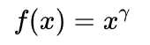

# 预处理：

1. 使用伽马矫正，调节图像对比度，减少光照对图像的影响（包括光照不均和局部阴影），使过曝或者欠曝的图像恢复正常，更接近人眼看到的图像。

   **伽马矫正公式**：输出图像是输入图像的幂函数，指数为γ

   

   ```python
   import cv2
   import numpy as np
   img = cv2.imread('gamma.jpg', 0)
   img2 = np.power(img/float(np.max(img)), 1.5)
   ```

   

2. 

# 