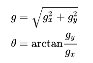

# 第一篇：嵌入注意力机制模型的人脸表情迁移学习方法

## 解决的问题：

域适应人脸表情迁移学习，设计一个深度网络降低跨域数据集的分布不同的转换问题。

## 解决方法

1. 将条件对抗域适应方法应用于人脸表情迁移学习
2. 应用熵函数保证分类器预测的不确定人脸表情图像的可迁移性
3. 通过嵌入注意力机制模型来改进深度学习网络对人脸表情图像的特征提取

## 实验结论

有效地提高了实验室控制和现实生活中的人脸表情数据识别的准确率

## 传统方法缺陷

1. 传统的人脸表情识别研究主要采用手工进行特征分类，费时费力，且准确性与特征选择好坏密切相关

2. 带定态表达式的实验室控制数据库并不能反映现实世界中复杂场景。（不同人特征不同）

   **解决方法**：通过深度学习网络学习源域数据的信息来减少跨域数据之间的分布差异。

3. 卷积神经网络虽然具有良好的识别性能和鲁棒性，但是训练需要大量的数据

   **解决方法**：使用深度学习

4. 以往迁移学习算法没有通过学习不变的特征来表示源域和目标域之间的关系，也没有考虑使用标记源域数据和未标记目标域数据的影响 

   **解决方法**：在深度网络结构中嵌入域适应模块。
   
5. 现有对抗性域适应方法的问题：

   - 不同跨域的特征与类别的分布进行融合时，仅应用特征表达f不够。
   - 由于特征分布是多模态的，即在现实场景下其性质是一个多分类问题，因此特征表达对对抗网络来说较为困难。

   **解决方法**：使用条件对抗域适应方法。
   
6. 条件域鉴别器的极大极小问题对不同的图像数据进行了同样的处理，但是具有不确定预测的难以转移的图像数据可能会恶化条件对抗性适应过程。

   熵函数：（C表示数据集包含类的总数，g_c表示某一输入在分类器中预测为c类的概率。）

   

   **解决方法**：通过熵函数来量化分类器预测的不确定性。

7. 

## 提出的新方法

基于**条件对抗域适应框架**，嵌入**注意力机制模型**（丰富人脸特征、提高识别率），**条件生成网络**生成与真实图像相似的图像（辅助人脸表情的迁移学习），利用**熵**来区分样本的优先级（控制分类器预测的不确定性）

## 新方法的注意点

1. 由于数据集比较小，深度网络容易过拟合、网络退化。因此使用**ResNet50**网络进行人脸表情特征的提取

## 之前没学过的一些概念：

1. **域适应**：学习者利用来自源领域的大量标记数据，在标记数据很少或没有标记数据的情况下，帮助学习者学习目标领域的网络参数。

   即使用源域中的数据训练一个模型，要求在目标域上也能获得一个较好的性能

2. **ResNet**：ResNet是为了克服由于网络深度加深而产生的学习效率降低，解决准确率无法有效提升的问题（网络退化），可用于检测、分割、识别等领域。

3. 对抗网络能够最小化跨域的差异。

4. **对抗性学习在域适应中的应用**：

   - 通过训练域判别器D来区分源域和目标域
   - 同时训练过程中生成的特征表达F用来混淆域判别器D
   
5. **对抗域适应**：https://www.jianshu.com/p/8a6e71a4ea97

   可理解为训练数据and测试数据

6. **人脸表情类别**：愤怒（anger）、高兴（happiness）、悲伤（sadness）、惊讶（surprise）、厌恶（disgust）、恐惧（fear）、平静（neutrality）

# 第二篇：基于认知机器学习的人脸表情识别研究

## 解决的问题

由于要识别的人脸表情图片可能包含复杂的背景、以及人类的外貌、年龄、种族等存在差异，不同表情类别之间的区分边界可能模糊不清，导致表情识别方法的性能与人类的识别能力差距比较大。

主要的原因是模拟人类的认知能力不够

## 实验结论


## 传统方法缺陷

1. 目前的机器学习结果就是<u>形成惯性思维模型</u>。在数据量小的时候，会发生错误。

   目前解决这类问题的方法是设计更复杂的机器学习方法，或者接受人类的指导，如**强化学习**在运行过程中需要接受专家指导。

   **缺点**：会产生对抗样本问题，包括Alexs模型、GoogleNet模型。特别是一些人类容易识别、深度学习难以识别的样本。<u>*目前还没有解决方法*</u>。

2. 

## 提出的新方法

1. 指出了现有机器学习方法面临的问题：机器学习容易形成错觉惯性思维。

   分析了机器学习的惯性思维原理。

   提出了基于认知的机器学习框架、分析了框架中要解决的主要问题，为提出具体的新方法提供思路

2. 提出了一种**新的复杂度感知分类算法（CPC）**：针对样本特征分布进行有区分度的学习显著提高了人脸表情识别的分类准确率

3. 提出了一种新的样本感知的个性化人脸表情识别方法：

   - 采用贝叶斯学习方法从全局选择最优的分类器
   - 用选择的分类器识别每个测试样本的情感类别

   基于样本感知方法（SAP）从给定的基本分类器中选择最适合对给定的测试样本进行分类的分类器，更符合人类的认知规律、具有个性化的分类能力。

   实验表明：**SAP在情感识别方面比其他任何基本分类器更有效**

4. 提出一种**基于逆向思维**的机器学习方法，提高机器学习方法的泛化能力（还可以考虑别的创造性思维方法）。

## 新方法步骤

1. **预处理**：人脸切割（Adaboost算法去掉头发等非人脸表情特征，通过主动外观模型ASM算法识别出人脸轮廓并截取人脸区域）、图像归一化（光照归一化、灰度归一化、尺度归一化）

2. **特征提取**：

   - 提出了一种新的启发式分类算法，命名为<u>复杂度感知分类算法（CPC）</u>。针对样本复杂度进行有区分度的学习显著提高了人脸表情识别的分类准确率。
   - 提出了一种新的<u>基于样本感知的个性化情感识别方法SAP</u>。采用贝叶斯学习方法从全局选择最优的分类器。
   - 提出了一种基于逆向思维的机器学习方法RTML，提高了机器学习方法的泛化能力。
   
3. **基于复杂度感知的人脸表情识别方法**：**简单样本用惯性思维解决，复杂样本用逆向思维**。

   **区分简单样本or复杂样本**：训练数据库

   - 若一个样本被很多分类器正确分类，那么这个样本对于分类是容易的。

   **前提**：人脸表情7个基本类别之间存在联系。一些表情比如：Happy和Surprise属于辨识度很高类别，很容易区分。而对于Fear和Sad在有些环境下非常相似且难以区分。

   由于对于是**直接测试了样本的复杂度**，不是采用计算测试样本的邻域，因此可以获得<u>全局最优性能</u>，同时可以<u>很好地解决样本复杂度分布不均匀</u>的问题。

4. **测试样本复杂度鉴别分类器**：

   用｛+｝标签标记容易分类样本集，用｛-｝标签标记复杂分类样本集。

   通过这两类数据训练一个样本复杂度鉴别分类器。

   **步骤**：首先利用KNN从训练样本中找到p个最近邻，并使用这些带有复杂度标签的近邻动态训练局部Logistic回归分类器

5. **基于样本感知的个性化情感识别方法SAP**：

   采用贝叶斯学习方法从全局选择最优的分类器，然后用选择的分类器识别每个测试样本的情感类别。（把样本感知的思想方法引入到情感识别领域）

   **集成分类器**把所有的分类器平均化，也就<u>弱化了最强的分类器</u>。SAP在训练数据集上计算每个候选分类器对每个验证样本的分类能力，进而通过贝叶斯定理计算每个验证样本的最合适的分类器。

   **注：SAP方法理论上指派给不同分类器的测试样本数量越分散，越有互补性，效果越好，可以作优化。**

6. **逆向思维模型**：

   <u>将难数据使用错觉惯性思维模型分类数据，然后再采用逆向思维模型纠正分类结果</u>

   

   <u>推导过程见论文第五章</u>


## 没学过的概念

1. **样本感知方法（SAP）**：？？？

2. 面部肌肉单元变化与人脸表情相关。“面部行为编码系统”（Facial Action Coding System， FACS）是一个基于人类表情共性创建的面部行为编码系统。

3. **人脸表情识别系统的主要步骤**：图像预处理、特征提取和表情分类

   

   ---

4. **国内外常用的人脸表情数据库**：

   - **JAFFE数据库**：10名日本女性共213副图像，每人7种表情

   - **Fer2013数据库**：包含28709个训练图像、3589个验证图像和3589个具有六个基本表情加中性表情标签的测试图像。所有图像均为灰度图像，大小为48*48像素。该数据库与现实世界数据很接近。人类识别率为65±5%。

     该数据库由三个部分组成：训练集的Fer2013-TRAIN、验证集Fer2013-PUBLIC和测试集Fer2013-TEST

   - **Cohn-Kanade数据库和CK+数据库**：含有各种族人群包含各种动作单元的表情图像序列。共有7种表情，全部来源于210个参与者，共2000个左右具有较好的正面光照的灰度图像序列。每幅图像的分辨率大小为640*490。

     **Cohn-Kanade扩展数据集（the extended Cohn-kanade, CK+）**是目前比较通用的人脸表情数据集。包含123名参与者、593个图片序列。其相比于CK数据集，还包括了动态视频。

     两者都含有情绪标签，指出了参与者的表情。

   - **RAF2017数据集**：通过分析从互联网上下载的29672张大不相同的人脸图像中的120万个标签而构建的。该数据库中的图像在受试者年龄、性别、种族、光照条件、头部姿势和遮挡方面差异很大。包括7类基本情绪和12类复合情绪。

   - **其他数据集**：北京航空航天大学数据集、英国帝国理工大学的人机交互研究实验室创建MMI数据库、中国科技大学建立自然可见和红外人脸表情数据集（Natural Visible and Infrared facial Expression, USTC-NVIE）、野外动态人脸表情数据集（Acted Facial Expressions in the Wild， AFEW）、野外静态人脸表情数据集（Static Facial Expressions in the Wild， SFEW）

5. **Adaboost算法**：核心思想是针对同一个训练集训练不同的分类器（弱分类器），然后把这些弱分类器集合起来构成一个更强的最终分类器。

   算法步骤如下：

   - 先通过对N个训练样本的学习得到第一个弱分类器
   - 将分错的样本和其他的新数据一起构成一个新的N个的训练样本，通过对这个样本的学习得到第二个弱分类器
   - 将1和2都分错了的样本加上其他的新样本构成另一个新的N个的训练样本，通过对这个样本的学习得到第三个弱分类器
   - 最终经过提升的强分类器。即**某个数据被分为哪一类要由各分类器权值决定**

6. **主动外观模型ASM算法**：基于点分布模型（Point Distribution Model，PDM）的算法。在PDM中，外形相似的物体的几何形状可以通过若干关键特征点（landmarks）的坐标依次串联形成一个形状向量来表示。例如对人脸：

   

   **具体原理见**：https://cloud.tencent.com/developer/article/1005770

   ---

7. **双线性内插法**：使用邻近4个点的像元值，按照其距内插点的距离赋予不同的权重，进行线性内插。

   该方法具有平均化的低通滤波效果，边缘受到平滑作用而产生一个比较连贯的输出图像。（低通滤波可以去除细节信息，高通滤波反之）

   缺点是破坏了原来的像元值，在后来的波谱识别分类分析中，会引起一些问题

8. **时间插值算法**：？？？没找到

9. **表情的特征提取**：目前特征提取算法大致分为两个部分：基于人脸区域的特征提取和基于整体图像的特征提取。

   

   **基于纹理**：

   - **Gabor过滤器**：Fourier变换是一种信号处理的有力工具，可以将图像从空域转换到频域，并提取到空域上不易提取到的特征。但是Fourier变换缺乏时间和位置的局部信息。

     Gabor变换是一种<u>短时加窗Fourier变换</u>（简单理解起来就是在特定时间窗内做Fourier变换），是短时傅里叶变换取为高斯函数时的一种特殊情况。因此Gabor滤波器<u>可以在频域上不同尺度、不同方向上提取相关的特征</u>。

     另外，Gabor函数与人眼的作用相仿，<u>经常用作纹理识别</u>，效果较好。

   - **局部二进制模式（LBP）**：是一种<u>理论简单、计算高效的非参数局部纹理特征描述子</u>。在图像分析、计算机视觉和模式识别领域得到了广泛的应用。

     

     采用圆形邻域系统(如图2所示)来计算LBP模式，并通过采用不同大小的圆形邻域系统(如图3所示)将LBP扩展到多尺度上,没有位于图像像素中心位置的邻域像素采用双线性差值方式获得。

     

     基于p个邻接采样点的LBP模式总共有2^p种，用于表示整幅纹理图像的LBP直方图矢量的维数为2^p**（？）**。通过改变参数对（r，p）的值，可以获得不同尺度上的LBP模式。建议为：（1，8）、（2，16）……（r，8r）

     **缺点**：

     - 不具有旋转不变性，而要提高一个特征描述子的实用性，需要增强对图像旋转变化的鲁棒性。
     - 全局LBP直方图矢量的维数随着p的增加而成指数增长。

     为了克服以上两个缺点，还有“**旋转不变LBP模式**与**均匀（uniform）LBP模式**”，详细看：https://blog.csdn.net/u012507022/article/details/51602916

     ---

   - **基于多尺度块的LBP——MB-LBP**：

     - **多尺度**：所谓多尺度，实际上就是对**信号的不同粒度的采样**，通常在不同的尺度下我们可以观察到不同的特征，从而完成不同的任务。通常来说粒度更小/更密集的采样可以看到更多的细节，粒度更大/更稀疏的采样可以看到整体的趋势。

       

     - **图像金字塔**：多尺度的信号已经包含了不同的特征，为了获取更加强大的特征表达，会使用**图像金字塔**和**高斯金字塔**。

       1. **图像金字塔**，即一组不同分辨率的图像：

          

          采样的方式可以是不重叠或者重叠的，如果是不重叠的，采样尺度因子为2，那就是每增加一层，行列分辨率为原来的1/2。

       2. **高斯金字塔**：为了满足采样定理，每一个采样层还需要配合平滑滤波器。因此更常用高斯金字塔，每一层内用不同的平滑参数，在经典的图像算子SIFT中被使用。

          - **采样定理**：在进行模拟/数字信号的转换过程中，当采样频率fs.max大于信号中最高频率fmax的2倍时（fs.max>2fmax），采样之后的数字信号完整地保留了原始信号中的信息，一般实际应用中保证采样频率为信号最高频率的2.56~4倍。

          

     - **计算机视觉中的多尺度模型架构**：

       卷积神经网络通过逐层抽象的方式来提取目标的特征，其中一个重要的概念就是**感受野**。<u>如果感受野太小，则只能观察到局部的特征，如果感受野太大，则获取了过多的无效信息</u>，因此研究人员一直都在设计各种各样的多尺度模型架构，主要是**图像金字塔**和**特征金字塔**两种方案，但是具体的网络结构可以分为以下几种：*(1) 多尺度输入。(2) 多尺度特征融合。(3) 多尺度特征预测融合。(4) 以上方法的组合*。

       1. **多尺度输入网络**：就是使用<u>多个尺度的图像输入（图像金字塔）</u>，然后将其结果进行融合。

          传统的人脸检测算法**V-J框架**就采用了这样的思路。

          <u>多尺度模型集成的方案在提高分类任务模型性能方面是不可或缺的。</u>

          仅采用多个尺度的预测结果进行<u>平均值融合</u>，就可能提高2%以上的性能。

       2. **多尺度特征融合网络**：常见的有两种，<u>并行多分支网络</u>和<u>串行的跳层连接结构</u>。都是在不同感受野下进行特征提取。

          - **并行多分支结构**：能够在同一层级获取不同感受野的特征，经过融合后传递到下一层，<u>可以更加灵活地平衡计算量和模型能力</u>

            比如Inception网络中的Inception基本模块，包括有四个并行的分支结构，分别是1×1卷积，3×3卷积，5×5卷积，3×3最大池化，最后对四个通道进行组合。

            

            除了更高卷积核大小，还可以使用带孔卷积来控制感受野。

            

            还有一种比不同大小的卷积核和带孔卷积**计算代价更低的控制感受野的方法**，即**直接使用不同大小的池化操作**。对于分辨率大的分支，使用更少的卷积通道，对于分辨率小的分支，使用更多的卷积通道，这样的方案能够**更加充分地使用通道信息**。

          - **串行多分支结构**：将不同抽象层级的特征进行融合，<u>对于边界敏感的图像分割任务是不可缺少的</u>

            串行的多尺度特征结构以FCN[6]，U-Net为代表，需要通过**跳层连接**来实现特征组合，这样的结构在图像分割/目标检测任务中是非常常见的。

            

          - **多尺度特征预测融合**：在**不同的特征尺度进行预测**，最后将结果进行融合。以目标检测中的SSD为代表

            在多个特征通道进行预测的思想与多个输入的方案其实是异曲同工的，但是**计算效率更高**。

          - **多尺度特征和预测融合**：同时使用“将不同尺度的特征进行融合”、“在不同尺度进行预测”两种机制。即<u>将高层的特征添加到相邻的低层组合成新的特征，每一层单独进行预测</u>。也可以<u>反过来将低层的特征也添加到高层</u>。

            对于不同尺度的特征图的融合，还可以使用基于学习的融合方案。

   - **局部Gabor二进制模式（LGBP）**：LBP特征是对图像纹理的一阶描述，不能反映空间结构信息。

     以灰度共现矩阵（Gray Level Co-occurrence Matrix，GLCM）替代传统的直方图，将其改进能够表征空间特定结构信息。

   - **方向梯度直方图（HOG）**：见https://zhuanlan.zhihu.com/p/85829145

     - **伽马矫正**：可以调节图像对比度，减少光照对图像的影响。

     - **计算梯度图**：为了得到梯度直方图，需要<u>先计算水平和垂直梯度</u>。可以通过使用以下内核过滤图像来实现，分别用于计算<u>水平梯度</u>和<u>垂直梯度</u>。

       

       可以使用内核大小为1的Sobel算子，来获得相同的结果。

       关于Sobel计算梯度的详细内容，可以去看 [这篇文章](https://zhuanlan.zhihu.com/p/67197912)

       再<u>计算x和y方向梯度的合梯度</u>，包括幅值和方向：

       

       **注**：梯度方向会取绝对值，因此得到的角度范围是[0，180°]

       ```python
       import cv2
       import numpy as np
       
       # Read image
       img = cv2.imread('runner.jpg')
       img = np.float32(img) / 255.0  # 归一化
       
       # 计算x和y方向的梯度
       gx = cv2.Sobel(img, cv2.CV_32F, 1, 0, ksize=1)
       gy = cv2.Sobel(img, cv2.CV_32F, 0, 1, ksize=1)
       
       # 计算合梯度的幅值和方向（角度）
       mag, angle = cv2.cartToPolar(gx, gy, angleInDegrees=True)
       ```

       

     - **计算梯度直方图**：

       把整个图像<u>划分为若干个</u>8*8的<u>小单元</u>，称为**cell**，并计算每个cell的梯度直方图。这个cell的尺寸也可以设定为其他值，根据具体的特征而定。

       **问**：为什么要把图像分为若干个8*8的小单元？

       **答**：由于对于一整张梯度图，其中的有效特征是非常稀疏的，不但运算量大，而且效果可能还不好。于是就是用特征描述符来表示一个更紧凑的特征。一个8\*8的小单元就包含了8\*8\*2=128个值。（每个像素包括梯度的大小和方向）

       计算出梯度直方图后，可以用9个数的梯度直方图来代替原来很大的三维矩阵，即代替了8\*8\*2个值（详细见：https://zhuanlan.zhihu.com/p/85829145）

     - **Block归一化**：由于图像的梯度对整体光照非常敏感（通过将所有像素值除以2可以使图像变暗，同时梯度减小一半），在理想情况下， 我们<u>希望我们的特征描述符不会受到光照变化的影响</u>，因此需要将直方图**归一化**。

     - 计算**HOG（方向梯度直方图）特征向量**：是一种在计算机视觉和图像处理中用来进行物体检测的特征描述子。

       **优点**：（非常适合用来作行人检测）

       1. 对图像几何和光学的形变都能保持很好的不变性。
       2. 可以允许有一些细微的动作。

       ```python
       from skimage import feature, exposure
       import cv2
       image = cv2.imread('/home/zxd/Pictures/Selection_018.jpg')
       fd, hog_image = feature.hog(image, orientations=9, pixels_per_cell=(16, 16),
                           cells_per_block=(2, 2), visualize=True)
       
       # Rescale histogram for better display
       hog_image_rescaled = exposure.rescale_intensity(hog_image, in_range=(0, 10))
       
       cv2.imshow('img', image)
       cv2.imshow('hog', hog_image_rescaled)
       cv2.waitKey(0)==ord('q')
       ```

   - **尺度不变特征变换（SIFT）**：是一种用来侦测与**描述影像中的局部性特征**的算法。在空间尺度中寻找极值点，并提取出其位置、尺度、旋转不变数。

   优化过程中的一些知识点：**LBP特征高效、混合纹理特征方法可以解决FER中不同文化和民族之间的差异、采用随机森林分类器可以提高识别性能、将人脸区域划分为几个特定的局部区域并利用人脸表情进行识别识别精度更高、基于奇异值分解（SVD）的共聚方法搜索人脸特征的最显著区域，可以提高识别率**

   **典型的几何特征提取算法**：

   - **AAM（主动外观模型）**：基于主动外观模型的图像分割算法，该方法可以分为两大部分，第一部分是训练部分，即构造一个事物的主动外观模型，这部分需要一个训练集，它的作用是让程序记住需要切割的图像的形状特征和外观特征;第二部分是图像分割阶段，这个部分是将刚才的训练集收集的关于该事物的特征在需要分割的图像里面寻找，找到与训练集相似的物体图像的轮廓和外观，然后将其从整幅的图像中分割出来。
   - **ASM（主动形状模型）**：一种较为成熟的人脸特征点定位方法。它用局部纹理模型在特征点周围进行局部搜索，用全局统计模型约束特征点集组成的形状，二者反复迭代，最终收敛至最优形状。主动形状模型在速度方面具有较大优势，一般应用于实时性要求较高的场合。

10. **基于模型的识别方法**往往基于人体面部区域的解刨学信息，<u>使用网格将静态图像转化为变形曲面的匹配问题</u>。

11. **弹性图匹配法**在人脸图像上选取特征点构成拓扑结构的弹性图，提取特征矢量，构选相似函数进行匹配

12. **光流法**利用图像序列中的像素强度数据的时域变化和相关性来确定各自像素位置的运动。

13. **表情分类问题**：一个经典的多分类问题。**近年常见的表情特征分类算法**有：贝叶斯分类法、隐马尔科夫模型算法、Softmax、随机森林、近邻法和支持向量机等。

    主要分为：基于**距离度量的分类方法**和**基于贝叶斯网络的分类方法**及**神经网络的分类方法**

    **基于距离度量的分类方法**：

    - **近邻法**

      优点：算法简单

      缺点：时空复杂度高

    - **SVM**

      优点：特别适合样本数量小的分类问题

      缺点：在多分类和大规模样本上还有待提高

    **基于贝叶斯网络的方法**：以贝叶斯公式为基础，基于概率推理的图形化网络。

    包括<u>各种贝叶斯网络分类算法</u>和<u>隐马尔科夫模型算法</u>。

    **基于人工神经网络的方法**：模拟人类大脑神经组织

14. **人脸识别问题的主要挑战**：

    - 样本数据库不完备、不充分。缺乏大规模高质量、有标签的表情数据
    - 人类面部图像复杂
    - 情感类别的相似性与表情的强度定义
    - 图像质量

15. **训练样本理论上越多越好**。<u>卷积神经网络有效的主要原因</u>在于其对每个输入的样本进行了卷积变换，从而生成了类似的多个样本。

    深度学习中**生成式对抗网络模型（Generative Adversarial Networks）**可以生成大量新样本。

    **经典生成式模型的两大困难**：

    - 需要大量的先验知识区域建模真实世界，包括需要假设真实世界的概率分布
    - 真实世界的数据往往很复杂，这样用来拟合模型的计算量往往非常庞大

    **GAN**包含一对模型：<u>生成模型</u>和<u>判别模型</u>，都是常见的卷积网络。前者从随机向量生成一个样本，后者鉴别样本是生成的新样本还是训练样本。两者同时训练，<u>在训练鉴别器时，最小化鉴别误差；在训练生成器时，最大化鉴别误差</u>。两个目的均通过反向传播方法实现。

    > 此方法可归纳到创造性思维框架，其通过**添加随机噪音产生新样本**，而鉴别器用来评价生成样本的价值。
    >
    > 除了随机噪音以外，还有很多别的方法：<u>等价变换，组合创造，逆向思维</u>

16. **深度学习的巨大成功来源于它自动从大量样本中学习抽取有用的特征——特征学习。**

    深度学习主要分为两大类：

    - 深度信任网络DBN
    - 深度卷积神经网络CNN（<u>**ResNet**和**DenseNet**是CNN近期的经典改进版本</u>，不但缓解了深度 网络在反向传播中容易出现梯度消失的问题，而且显著提高了分类的准确率。）

    深度学习中可以<u>保持信息不丢失</u>的新网络：i-RevNet网络

    - **ResNet**改进：在ResNets中，残块特征映射的输出由非线性变换的复合函数H(x)和恒等函数组成。

      

      这种组合方式可能会<u>阻碍信息在深度网络中的流动</u>。

      **改进方式**：在DenseNet的推动下，将两个输入以concat的组合模式来将两个特征图串接在一起。特征映射的输出函数：

      

    - 

17. **动态分类器**：对每个测试样本，<u>都寻找测试样本所在的局部邻域，然后通过邻域内的样本来评估每个分类器的能力</u>，选择一个最合适的分类器对测试样本分类。

    选择方法可分为：

    - 直接利用邻域的样本信息来度量每个分类器的能力
    - 采用机器学习的方法来动态选择分类器

    <u>动态分类器符合人类的认知规律</u>，但是现有方法都是根据样本在训练集中的邻域实现的。难以取得全局优化的性能。

    **最典型的度量方法**：（这些度量方法都是根据测试样本在训练集中的邻域来选择分类器，<u>难以获得全局考虑的性能</u>，并且，为每个测试样本从大的训练集中寻找邻域是一个<u>很费时</u>的事情）

    - 基于个体的度量：利用分类器的个体信息，如排名、准确率、概率等
    - 基于团体的度量：考虑候选分类器之间的关系

18. **动态分类器研究现状**：

    - **基于局部邻域的分类准确率**：算则局部邻域中准确率最好的分类器

      基于测试样本的局部邻域的分类准确率。

      其中邻域通过KNN算法或聚类算法实现。

      还有<u>先验概率方法</u>和<u>后验概率方法</u>

    - **决策模板方法**：同样基于局部邻域，但是是在<u>决策空间中定义的局部</u>，不是在特征空间中。

      决策空间由每个样本的分类器输出构成，每个输出向量就是一个模板，然后比较输出向量之间的相似性。

      例如：<u>K-Nearest Output Profile方法</u>

    - **候选分类器方法**：

      由于动态选择分类器算法中，候选分类器的组成很重要，<u>需要满足准确率和多样性</u>。

      有一些方法<u>侧重于为每个候选分类器选择训练子集</u>，例如：粒子群算法直接采用进化算法来为每个候选分类器选择训练集合。

      还有一些<u>采用异构分类器</u>，由于这些候选分类器的原理存在差异性，多样性更容易保持。

    - **采用机器学习方法**（这是最新的方法）：

      最新方法是：利用测试样本的局部邻域特征，称为**元特征**，包括分类器对邻域样本的分类情况，测试样本分类后的类后验概率等。它们作为机器学习的训练样本。

      另一种是采用遗传算法来划分多个训练集，每个训练集用于训练分类器，适应度函数定义为每个分类器的准确率再加上每个训练集的复杂性。不计算该类特征，而是<u>直接根据贝叶斯将原始的每个训练样本赋予分类器，即将分类器作为原始训练样本的类别标签。</u>

19. **集成学习**：通过数据集成、特征集成和决策集成来实现。

20. 

## 没看懂的内容

1. 时间插值算法相关内容没找到

# 第三篇：Affective computing in education: A systematic review and future research（情感计算在教育中的应用：系统综述与未来研究）

## 解决的问题

在教育领域情感分析的综述文章。

（选取了2010-2017的94篇论文）

## 结论

(1)近年来，情感计算在教育中的重要性显著提高;

(2)大多数情感计算研究的目的是设计情绪识别和表达系统/方法/工具，以及情绪、动机、学习风格和认知之间的关系;

(3)尽管情感计算在社会科学和管理领域得到了积极的研究，但大量研究主要集中在情感识别系统的设计和情绪状态的调查上，没有明确指定学习领域;

(4)情感测量可分为文本通道、视觉通道、声音通道、生理通道和多模态通道，其中文本通道是近年来应用最广泛的情感测量通道;

(5) AEQ是教育研究中情感计算研究中最常用的问卷;

(6)文本与视觉通道的融合是情感计算研究中应用最广泛的多通道;

(7)对情绪状态的描述倾向于维度理论/模型，其中Pekrun(2006)提出的成就情绪控制价值理论被广泛采用;

(8)无聊、愤怒、焦虑、快乐、享受、悲伤、沮丧、骄傲、希望、绝望、羞耻、困惑、快乐、自然情感、恐惧、喜悦、厌恶、兴趣、放松和兴奋，是前20种情绪状态。

情感测量通道分为**文本通道、视觉通道、语音通道、生理通道和多模态通道**，其中<u>**文本通道**被认为是应用最广泛的情感测量通道</u>。同时，**文本与视觉通道的融合**是情感计算研究中<u>应用最广泛</u>的多通道。

维度理论/模型是描述情绪状态最受欢迎的模型。

无聊、愤怒、焦虑、愉悦、惊喜、悲伤、沮丧、骄傲、希望、绝望、羞耻、困惑、快乐、自然情感、恐惧、喜悦、厌恶、兴趣、放松和兴奋被报告为教育领域的前20种情绪状态。


**在该论文中将论文的研究目的分为以下四类**：

1. 研究情绪对用户意图、成就和表现的影响
2. 设计情感识别与表达系统/方法/工具
3. 检验情绪、动机、学习方式与认识的关系
4. 评价教师行为对学生情绪和动机的影响

**热门学习领域**：

1. 社会科学与管理（21%）
2. 工程与技术（19%）
3. 自然科学（15%）
4. 艺术与人文（6%）
5. 生命科学与医学（4%）

**情感测量渠道和方法**：

1. 文本通道：大多数采用自我报告的方法，通过问卷调查（32）、文本？（14）专家观察（3）等
2. 视觉通道：面部表情（8）
3. 生理通道：脑电图（4）、眼动（3），心电图、心率变异性、皮肤电导水平（各2）
4. 多通道：16

> 注：声音通道被认为是一种独特的通道，只在多通道中应用，没有单独应用的情况


**多通道**：主要的整合策略有：文本、视觉和生理(三项研究)，视觉和声音(两项研究)，文本+视觉+声音、文本+声音+生理、视觉+声音+生理、文本+声音+语音+生理(各一项研究)

- **主要应用的理论/模型**：

  1. Pekrun（2006）提出的成就情绪控制价值理论（the control-value theory of achievement emotions）应用最广泛
  2. Kort，Reillt，Picard（2001）的学习螺旋模型（learning spiral model）
  3. Russell（1980）的环绕模型（circumplex model of emotions）
  4. 其他模型：动机中介信息加工的有限容量模型（Limited Capacity Model of Motivated Mediated Message Processing），评价激活空间（evaluation-activation space），情绪环模型（Circumplex model of affect），Feidakis的情绪模型

- **主要使用的情绪状态**：无聊、愤怒、焦虑、享受、惊讶、悲伤、沮丧、骄傲、希望、无望、羞愧、困惑、快乐、自然、恐惧、快乐、厌恶、兴趣、放松、兴奋

  > 注：更关注消极情绪，认为如果能够管理消极情绪状态，就能显著提高学习者的表现

- **情绪测量通道的情绪状态分布**：

  1. 文本通道主要应用于无聊、愤怒、焦虑、享受
  2. 视觉通道主要应用于惊讶、愤怒、悲伤、厌恶
  3. 生理通道主要应用于无聊、沮丧
  4. 多模态主要应用于愤怒、惊讶、沮丧、困惑等

### 情感计算的趋势：

研究越来越多，越来越重视

### 所选论文的主要研究目的和学习领域

1. 67%设计情绪识别与表达的系统/方法/工具（会加入新的设备：摄像机、传感器等，利用最新的信息技术：云计算、物联网等）

   <u>考虑色彩、色度、亮度等色彩特征对情绪的影响，关注不同学习情境下的情绪差异和颜色偏好可以成为另一个研究方向</u>

2. 检验情绪、动机、学习风格和认知之间的关系

3. 情绪对用户意图、成就和表现的影响

### 所选论文中主要使用的情感测量渠道和方法

五种主要的情感测量渠道：

1. 文本：问卷、自我报告、专家观察
   - 需要开发一个多维问卷，要求足够全面，可以测量不同的情绪
2. 视觉：面部表情、头部姿势、身体姿态、眼神凝视、击键动力学
3. 声音（不单独使用）：语音、韵律、语调
4. 生理：EMG、ECG、HR、HRV、EOG、EEG、EDA、BVP、SCL、呼吸频率、温度和眼动跟踪
5. 多模态（多视听）：上述的集成（在资金有限或者可用设备有限的情况下，使用文本和视觉是适当的情感识别渠道）
   - 由于硬件和匹配软件的最新发展，面部模拟的质量已经显著提高，因此基于多模态的研究<u>主要试图利用视觉通道</u>，特别是面部表情方法来解决文本通道的挑战。
   - 如何整合不同渠道获得更好的效果，如何处理不同方法处理后的分歧
   - 主要是试图利用视觉通道，特别是面部表情方法来解决文本通道的挑战(如**霍桑效应**、缺乏识别情感状态变化的能力）

注：

- 单一采集声音数据是最没用的。
- 缺乏对更详细/可靠的生理特征的捕捉和分析限制了情感语音合成和识别系统（需要设计情感交互多主体系统，通过声音、面部表情和生理信号精确捕捉人的情绪）
- 在语音情感识别中，学习在无约束和噪声环境下有效利用自然语音片段表示是一个巨大的挑战
- 除了个人语音渠道外，通过其他渠道收集和传递信息和知识更有效

#### 五种渠道的优缺点：

- 虽然**使用文本简单、廉价，但是由于文化、语言差异，不能实时也不够准确。**

- **可视化方法提供了额外的信息，但是与很大程度上无法扩展的噪声传感器、图像处理问题和隐私问题有关。**

- **声音传感器通过集成到交互式用户界面中来提供准确的信息，但是仅限于基于对话的学习系统。**

- **生理分析需要严格控制的环境条件以及专门、脆弱的设备，因此可能不总是适合学习环境。**

- 整合不同的输入源可以提高情感识别的结果，但是整合有相关的技术挑战，以及管理、解释各种渠道产生的大量数据比较困难。

  | *信道*   | *方法*                                                       | *Pros*                                                       | *Cons*                                                       |
  | -------- | ------------------------------------------------------------ | ------------------------------------------------------------ | ------------------------------------------------------------ |
  | *文本*   | 自我报告的问卷调查  自我报告的文本  专家观察                 | -易于实现和使用  -便宜，不依赖任何特殊设备的使用             | -文化和语言差异  -不够精确                                   |
  | *视觉*   | 面部表情  头部姿势  身体姿态                                 | -自然和可观察到的  -廉价设备例外的手势  -额外的信息  -实际部署 | -耗费时间和资源  -噪音  -图像处理问题  -隐私问题             |
  | *声音*   | 演讲  韵律和语调                                             | -自然,显而易见  -准确的  -可集成到交互式用户界面  -实际部署  | -仅限于基于对话的系统  -耗费时间和资源  -文化和语言差异      |
  | *生理*   | 脑电波  心电图  心率变异性  BVP（可能是手指血容量脉冲）  SCL（可能是皮肤传导水平）  心率  眼动跟踪 | -可扩展为实时处理 -易于获取生物信号                          | -难以察觉的  -舒适度和隐私问题  -需要严格控制环境条件  -专业的易碎设备  -主导情绪识别准确率低  -难以解释收集的数据 |
  | *多模态* | 文本、视觉、生理  文本、视觉  文字，视觉，声音，生理  文本、声音、生理  视觉、声乐  文本、视觉、声乐  视觉、声音、生理 | -克服个别渠道的限制  -提高单个通道的准确性                   | -与收集充分和现实的数据相关的技术挑战  -各种渠道产生的海量数据难以管理和解读 |

### 所选论文采用的情绪的主要理论/模型和考虑的情绪状态

1. 分类模型反映离散的情绪：恐惧和愤怒

   FACS和Ortony是情感相关研究中两个主要的分类模型

   Ekman's model是最常用的分类情感计算认知模型

2. **维度模型（考虑和描述了广泛的情绪状态，比较常用）**：将一个人的情感状态映射到一个多维空间。

   最流行的是：<u>成就情绪控制价值理论</u>（上面提到过了）

3. FACS是最广泛使用的编码和测量面部运动的系统

4. OCC模型是识别和解释情绪状态的著名基于认知的心理模型之一（FACS和OCC都不包括无聊和兴趣两个重要且相关的情感状态）

5. **混合分类：可能是未来的方向**

## 没学过的概念

1. **情感计算的主要目标**：识别和测量人们的外显情感表象，并将其与内隐情感联系起来。情感状态的识别有助于分析用户的反应，从而引出行为意图并产生合理的反映。

   这样可以开发一个情感感知系统，并在潜在的应用中改进用户界面。

2. 控制不良情绪（思考：过于积极的情绪也会产生负面影响）的**情感辅导系统**，可以用于教育系统，改善整体远程学习成果，以及为个性化教学。

3. 情绪对人们的决策、时间安排等活动都有重大影响，因此，有可靠的情绪识别方法去识别情绪、认知、决策、动机方面的关系是很重要的。

4. 已经有的一些研究：

   - 教师在学生情绪管理中的作用
   - 成绩对学生情感的影响
   - 学生做作业时的情绪状态

5. FACS：

6. Ortony

7. Ekman's model

8. OCC：

9. 成就情绪控制价值理论

## 没看懂的内容


# 第四篇：基于局部重力描述的深度卷积神经网络人脸表情识别（Facial Expression Recognition Using Local Gravitational Force Descriptor-Based Deep Convolution Neural Networks）

## 解决的问题

从面部图像识别自动面部表情在计算机视觉领域是一项具有挑战性的任务

## 解决方法

提出了一种基于深度学习的人脸表情识别方法。该方法由两部分组成。

- 前者利用局部引力描述子从人脸图像中发现局部特征，

- 后者将描述子输入到一个新的深度卷积神经网络(dcnn)模型中。

提议的 dcnn 有两个分支。

- 第一个分支探索几何特征，比如边、曲线和直线，
- 整体特征则由第二个分支提取。最后采用分级融合技术计算最终分类得分。

## 实验结论


## 传统方法缺陷

1. 传统特征提取仅限于人类经验，获取难度大，且性能差。近年来深度卷积神经网络更优。
2. 过去一些DCNN模型提取非常耗时，需要强大的资源。然后其中一些特征只有一小部分被使用。
3. 边缘检测用梯度捕捉微小变化即梯度（梯度是一个有大小M和方向D的矢量）。当强度剧烈变化时，例如在边缘附近，m会更大，

## 提出的新方法

1. 在计算M和D的图像时，采用基于重力的边缘描述符。因为其会利用周围的像素信息，不会考虑相邻像素在x，y方向上的差异。

   除了考虑局部边缘信息外，还需要考虑整体特征，所以在第二步中，将M和D图像输入到新的DCNN中提取有用信息。

   即：**浅层DCNN提取局部，主要DCNN提取整体**

2. **特征提取**：

   1. 利用gobar小波曲线、尺度不变特征变换、hog、LBP、minutiae points、haar小波、hbiv、DBN和边缘等常规特征。
   2. 采用支持向量机、前馈神经网络和极限学习机进行分类

3. 

## 新方法注意点


## 没学过的概念

1. 极限学习机
2. LSTM

## 没看懂的内容


