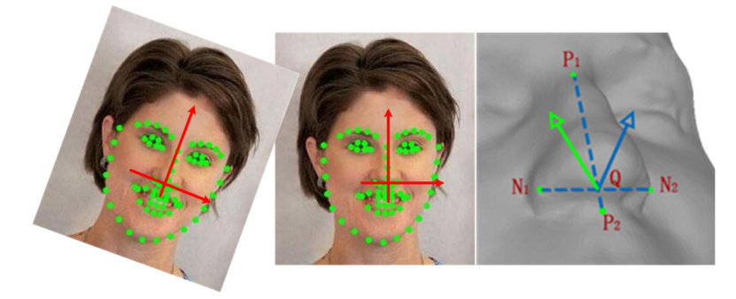
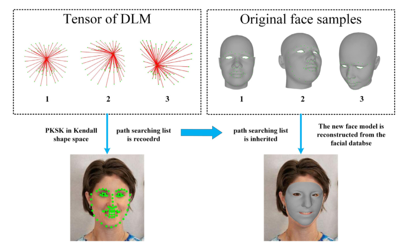
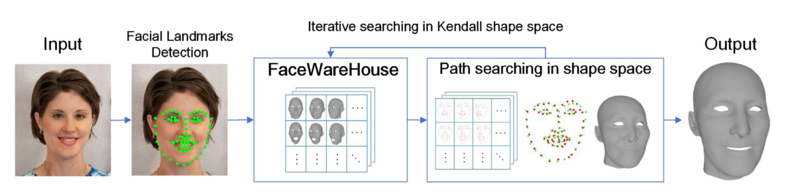
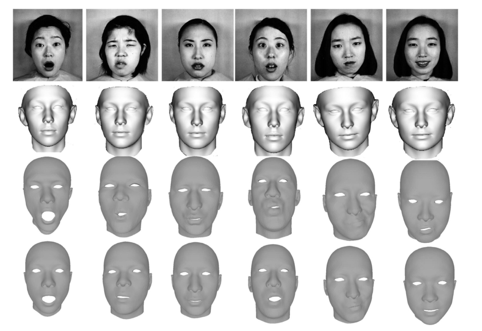
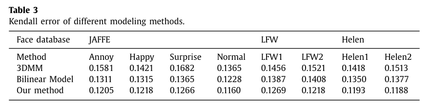

# 没看完：人脸身份对面部表情识别的影响：高密度ERP研究（Facial identity influences facial expression recognition: A high-density ERP study）2020

**关键词**：面部识别、面部表情、事件相关电位、Garner范式、N170

## 传统方法缺陷

## 解决方法

之前的面部识别模型表明：<u>面部特征和面部表情处理是独立的。</u>

但是在心理学**选择性注意力任务**中（使用Garner范式），揭示了特征感知和面部表情之间的不对称关系：

- 面部表情不影响面部特征识别
- 面部特征会影响面部表情识别

本文中采用Garner范式，记录高密度时间相关电位（ERPs），研究面部特征对面部表情识别的影响。

实验过程中，与特征不管的维度处理：

- 保持不变（控制变量）
- 变化（正交条件）

记录了在完成面部表情任务时的128通道脑电图，分析了早期视觉阶段的两个主要成分：P1和N170.

结果显示，条件对N170潜伏期有显著的主要影响。

## 新方法的注意点

1. 

## 实验结论

面部特征影响了反映面部结构编码的N170面部表情识别，因此，面部表情信息的计算可能是基于个体面部的独特结构

## PPT讲解：

1. 

## 之前没学过的一些概念：

1. 

## 未来的方向

1. 

## 一些想法

1. 

# 基于单幅图像中人脸标志点的三维人脸表情建模（3D facial expression modeling based on facial landmarks in single image ）2019

**关键字：**面部表情建模、kendall形状空间、头部姿势

## 传统方法缺陷

1. 从单一的二维面部图像建立面部表情模型困难，且不同的**头部姿态**和图像中**人脸数据的尺度**影响建模结果的准确性。

2. 对于二维人脸图，由于其**几何特征不完整**，且一般有不同的头部姿势以及拍摄角度。

   为了消除这些影响，需要通过二维图像建立一个三维人脸模型。

   且，使用二维图像进行三维建模的核心问题就是二维图像到三维人脸表情的对应

3. 传统的重建方法是基于能量函数拟合的面部特征点。

   - 使用不同的能量优化方法（最小二乘法、梯度下降法），可以从二维人脸图像中计算出三维人脸表情

   **缺点**：由于存在多个自由变量（头部姿势等），导致**计算量巨大、复杂度高，且容易受到局部最优的限制（这种复杂性增加了陷入局部最优的概率）**

1. 

## 解决方法

提出了一种基于单幅图像的人脸标志点的三维人脸表情建模方法。

- 基于面部特征，在**kendall形状空间**中进行表情建模

  **kendall形状空间：**对形状的数学描述，可以消除对称变换带来的影响

  利用该理论**可以将人脸特征点作为离散点集进行比较**

- 在kendall形状空间中的人脸表情建模过程可以看作是人脸之间的标志路径搜索。模拟结果更准确。

**方法步骤**：

1. 从面部图像中提取面部特征点，建立基于面部特征点的二维模型。

2. 基于Faceware-house（一个经典的3D面部表情数据库）不同姿态的二维面部特征模型构建Kendall形状空间

3. 将二维人脸特征模型作为源输入到Kendall形状空间，搜索数据库中的目标人脸特征模型。利用匹配到的模型恢复人脸数据

   

   

4. 

**优点：**

1. 计算成本较低
2. 仅是一个特征搜索，结果更加准确、稳定

## 新方法的注意点

1. 

## 实验结论

第一行原图，第二、三别人的模型，第四行本文中提出的模型

## 之前没学过的一些概念：

1. 面部表情建模的研究主要包括：

   - 二维人脸建模
   - 三维几何建模
   - **三维静态建模**
   - **三维动态建模**
   - 通过深度学习和流形学习实现的三维面部表情建模

   其中**三维静态建模**和**三维动态建模**在人脸合成和动画等方面得到了广泛的应用

2.  

## 未来的方向

在重建过程中加入更多的面部特征，并提供准确的面部表情识别方法

## 一些想法

1. 【7】提出了一种用于面部表情识别的二维面部建模方法
1. 【9】使用了类似的方法进行面部表情聚类
1. 【27】三维人脸匹配的变形建模方法

# 基于模型的特征提取和动作参数分类的面部表情识别（Facial Expression Recognition Using Model-Based Feature Extraction and Action  Parameters Classification）

## 传统方法缺陷

1. 

## 解决方法

本文提出的系统由**人脸特征提取**和**人脸表情识别**两个部分组成

**人脸特征提取：**

- 分别采用**点分布模**型和**灰度模型**进行特征提取
- 然后用10个动作参数描述面部特征上指定点的位置变化

**人脸表情识别：**

- 训练阶段：
  1. 给定90个不同的表达式，系统将所有训练表达式主成分分为6个不同的簇
- 识别阶段
  1. 给定一个人脸图像序列，通过提取10个AP（行为参数）来识别表情

**提出的模型**：一个两阶段识别模型：

- 基于2D情感空间集聚的分类
- 使用AP剖面相关进行面部表情识别

## 新方法的注意点

1. 

## 实验结论

## 之前没学过的一些概念：

1. 

## 未来的方向

## 一些想法

