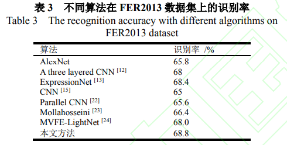

# 面部表情识别课程学习（Curriculum Learning for Facial Expression Recognition）

## 传统方法缺陷

1. 模型跨数据集的泛化
2. 个体差异的处理
3. 细微表情的识别。
4. 使用CNN缺乏大量数据，使得训练模型很难很好地一般化，跨数据集更难
5. 没有考虑面部表情的复杂性，在训练早起引入有噪声或困难的样本可能会影响模型的性能
6. 传统方法训练过程从简单的样本到困难的样本，然后引导模型获得更好的性能
7. 在深度神经网络中，采用随机梯度下降及其变化的迭代方式训练，但是深度学习网络的目标函数具有<u>高度非凸</u>的形状，因此<u>样本表示的顺序</u>对这类网络非常重要

## 解决方法

1. 借助“课程学习”的思想，先学习简单样本，再将训练后的模型作为识别复杂样本模型的一个构件
2. 将课程学习引入到深度卷积神经网络
3. 使用OpenFace处理人脸图像

## 新方法的注意点

1. 提出了两个假设

   - 图像中人脸表情具有不同的复杂度（✔）
   - 训练样本的顺序，简单的样本优先于复杂的样本有利于模型的优化

2. 使用了交叉熵函数来训练CNN模型

3. 一个潜在的问题：单个小批数据中包含不同级别的强度，这种小批量采样策略没有考虑图像样本的复杂性。

4. 认为具有较高秩的图像应该更早学习？（Why？）

   **能否借助全局复杂度感知？**

5. 训练过程中使用了“**婴儿步课程**”，即增加训练数据的复杂性，不同不丢弃简单样本。（其他课程学习策略效果不好）：Curriculum learning

6. 每次**间隔t时间模型还没有提升**时，就进入下一阶段，**同时降低学习率**，降低低程度图片的影响。

7. HOG + LBP，使用AlexNet作为模型，初始化权值为零均值高斯分布，标准差0.01。数据增强包括图像平移和水平反射

8. 将所有表情强度分为：低、中、高

## 实验结论

1. 高强度的表情更容易识别（大笑 > 微笑），在本文中以表情程度作为难度
2. 应用"婴儿步课程"，能取得较好效果
3. 先训练简单样本，有利于训练
4. 提出 样本复杂度 可以由预测成功率来估算
5. 未来：从图像扩展到视频，还有不同的课程策略

## PPT讲解：

1. Elman证明了当训练数据从简单到复杂的顺序呈现时，神经网络能够学习语法。当数据顺序随机时，则无法学习。

## 之前没学过的一些概念：

1. **OpenFace**：去除由于缩放和平面旋转而产生的变化，

## 一些想法

1. 看【24】，关于如何在越来越多的任务相关数据集中微调cnn，以取得更好的情绪识别结果
2. 

# 基于多尺度特征注意力机制的人脸表情识别

**关键词**：卷积神经网络、人脸表情识别、空洞卷积、通道注意力机制

## 传统方法缺陷

1. 传统卷积神经网络在人脸表情识别过程中存在**有效特征提取针对性不强**
2. 识别准确率不高
3. 卷积神经网络的网络结构<u>通常是简单地将卷积层和池化层线性叠加</u>，对图像的**多尺度特征提取不充分、且对重要的特征针对性不强**。（如何用网络提取重要特征？）
4. 卷积神经网络默认每个通道同等重要，但是实际上有区别。

## 解决方法

提出了一种基于多尺度特征注意力机制的人脸表情识别方法。

- 用**两层卷积层**提取浅层特征信息（只能提取到条状或者点状的局部信息）

- 在Inception结构基础上**并行加入空洞卷积**，用于提取人脸表情的多尺度特征信息

- 引入通道注意力机制和压缩-激励模块。增强对重要特征通道的响应。

  压缩-激励模块：分为Squeeze，Excitation，Scale三个操作

  

  

- 

**网络结构**：

、

## 新方法的注意点

1. 在设计网络架构时，若**网络层数**选取**过少**，对图像信息的**表达能力会有所欠缺**。**过多**则会**过拟合**
2. 为了防止网络层数加多时出现收敛速度变慢、数据分布不均等问题，在每个卷积层后都加入批归一化（Batch Normalization，BN）

## 实验结论

## 之前没学过的一些概念：

1. **Inception结构**：

2. **空洞卷积**：一种**不增加参数量的同时能增加输出单元感受野**的一种卷积神经网络。在卷积核内部元素之间加入空洞（即零元素），空洞个数被称为膨胀率

   （膨胀率为1时，即为普通卷积）

   

3. 深度学习是通过训练网络结构，用误差反向传播算法不断优化网络参数，使网络自动提取图像特征信息。

## 未来的方向

在优化网络结构的同时，**扩大不同表情的类差距（和平静状态下的本人作对比）**。

## 一些想法

1. 看【8】：基于几何纹理融合特征和高阶奇异值分解的人脸表情识别算法，可以有效排除由于个体面部差异而对表情识别造成的干扰
2. 看AlexNet、GoogleNet、ResNet论文
3. 【16】、【17】注意力机制

