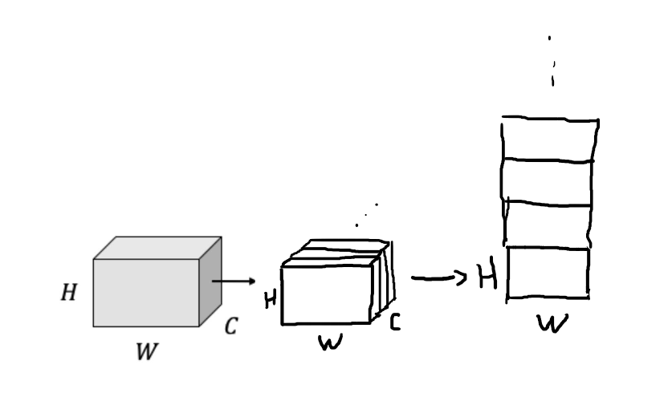
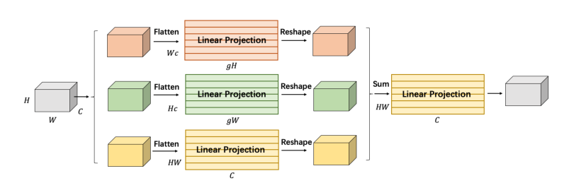
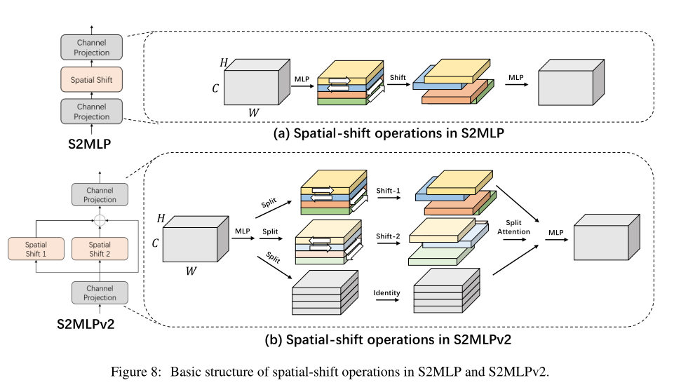
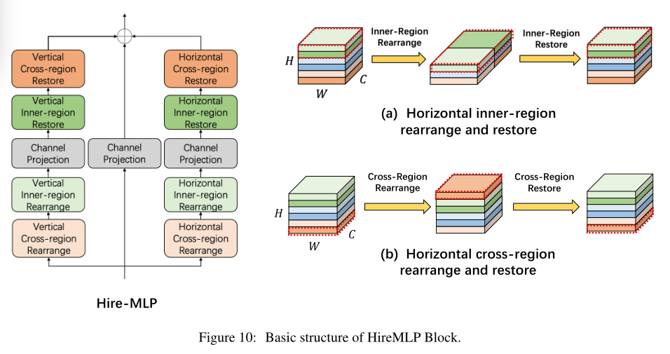
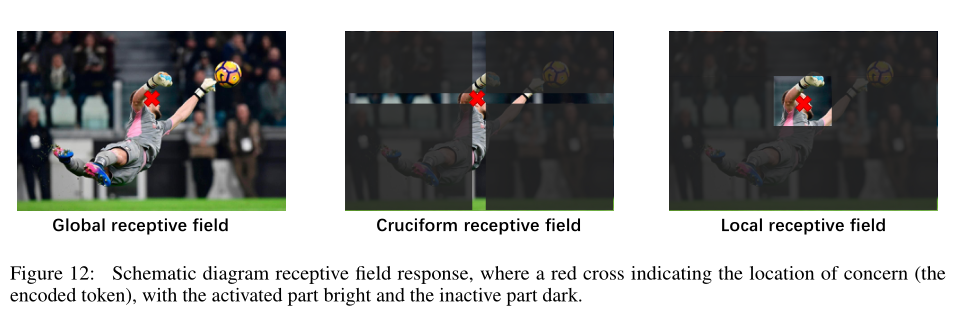
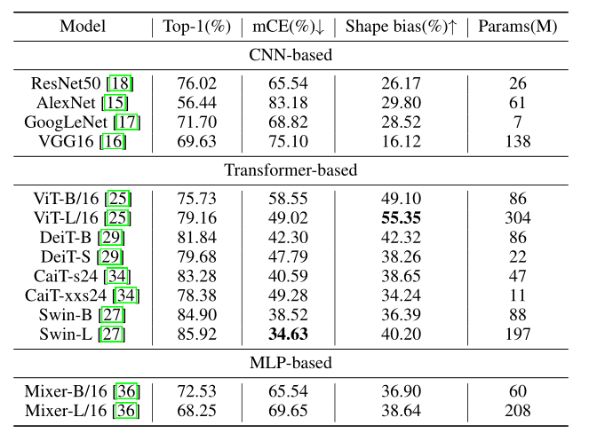
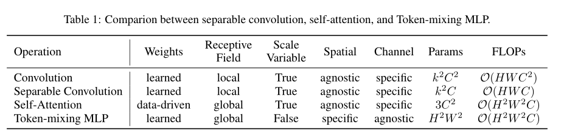
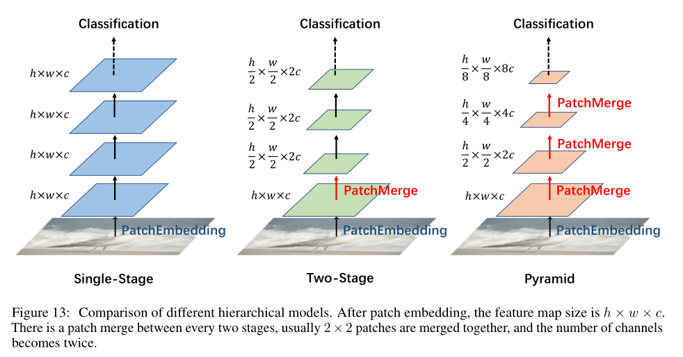

# 深MLP（ARE WE READY FOR A NEW PARADIGM SHIFT? A SURVEY ON VISUAL DEEP MLP）2021

**关键词**：面部情绪自动识别、情绪识别强度、行为生物特征识别系统、机器学习

## 传统方法缺陷

1. MLP**输入扁平化**是一个巨大的问题，还限制了输入分辨率。图像平坦化使输入单元固定，不能满足下游任务分辨率不敏感的要求（归一化？）

2. MLP参数量巨大，计算成本巨高

3. MLP网络深后梯度消失（ResNet？乘换加）

4. CNN提取局部特征，但是transformer的出现，说明**全局特征**更有效。

   ViT的参数更多，计算成本更大，人为干预越来越少，需要更多的训练数据

1. 

## 解决方法

## 新方法的注意点

MLP目前还面临一些瓶颈：

1. MLP更灵活且有更强的拟合能力，但是也有更大的过拟合风险。因此训练的时候需要更大的数据集
2. 令牌混合MLP的计算复杂度高，高分辨率图像难处理
3. 一旦设置了全连接层的节点数，就无法处理灵活的输入尺度，导致模型的迁移很困难
4. MLP模型是由相同架构的块组成的，导致在低分辨率下具有单一尺度的特征。因此，**非分层结构使得模型无法提供金字塔特征表示**，而金字塔特征已经被证明是非常重要的

为了应对上面的一些挑战，做的贡献：

1. 减少计算工作量
2. 消除分辨率敏感性
3. 引入局部感受域
4. 将整个网络设计成金字塔形状

> **结论**：近期的一些MLP模型都是针对令牌混合MLP进行了修改，除了gMLP。
>
> ​			且绝大多数的改进都使空间MLP不再对图像分辨率敏感

文中将MLP的变体分为三类：

1. 同时具有整个空间维数和通道维数的映射
2. 同时具有轴向维数和通道维数的映射
3. 仅具有通道维数的映射

轴向投影、通道投影的变量：

- 它们执行了**空间投影的正交分解**，大大减少了计算工作量，减轻了中等数据集的过拟合问题。

- 【89】中提出了一种视觉置换方法，该算法**通过线性投影对沿高度和宽度维度的特征表示进行单独编码**，这样可以允许ViP（视觉置换）在一个空间方向上捕捉长期依赖关系。

  （即每次少看一维）

  中间要按照通道切开，再按照高进行拼接

  

  

- 沿轴向编码空间信息，而不是沿整个平面编码。在一定程度上保持了空间信息的长程依赖性。并减少了参数量和计算量，在中型数据集上可以提高性能。但是仍然没有解决图像分辨率敏感问题。

仅通道投影变体：

- 解决了对图像分辨率的敏感性
- 通过移动特征图巧妙地引入了局部感受域的概念

包含空间投影和通道投影：

- 只提高了性能

- 为了实现分辨率不敏感，最简单的方法就是将所有空间全连接层替换为信道投影，即1*1卷积。

  **缺点**：会使每个patch不再相互作用，并且感受域的概念消失了

  **解决**：很多作品通过移动特征图，将不同空间位置的特征对齐到同一通道，然后通过通道投影与空间信息交互。这样可以利用MLP架构实现与类似CNN架构相同的局部感受域

  

  

  各种变体模型举例：

  1. （仅通道）百度的**空间转移MLP架构**【93】：v2版本中将空间位移模块扩展为**三个并行分支**，通过**分散注意力（Split-Attention）**融合分支特征，进一步提高网络性能

     

  2. 【98】中通过可变形卷积（deformable convolution）沿信道方向对不同空间位置的feature进行整合【99】

  3. 【100】HireMLP中采用了全新的“区域内重排 + 跨区域重排”的思想。

     - 区域内重排：

       首先沿着高度或宽度维度对特征图进行分组（图中是按照高度奇偶数进行分组）

       通过两个线性投影，进行信息混叠生成和之前相同形状的特征

     - 跨区域重排

     

  4. 【101】一种特殊的变体，只使用**信道投影**。称为ConvMLP，作者自称为分层卷积MLP。是一种轻量级的、阶段性的、卷积层的联合设计。

     为了混合空间信息，使用了深度卷积而不是移动特征。

     其实就是用 两个通道混合的MLP+一个GELU激活函数 替换了 CNN中的1*1卷积
  
  5. 【88】提出的gMLP中对符号混合体系的几种设计选择进行了试验，发现当**空间投影是线性的并与乘法门控相匹配**时，效果很好
  
     即先进行**空间投影（具体看论文P13）**，然后初始化W为近0值，b初始化为1，在刚开始训练时：
     $$
     X \odot f_{W, b}(X) \approx 1
     $$
     在计算机视觉和自然语言处理方面表现很好

  6. **【106】巧妙地解决了令牌混合MLP对空间位置的敏感性问题，同时保留了全局的感受域（可以利用这个）**

     **具体解决方法**：

     - 在通道维度上映射特征，在组内共享权重，在组之间改变权重 =》 循环信道特异性（CCS）令牌混合MLP。
  
       **优点**：

       1. 具有空间不变性和信道特异性
       2. 参数量减少到O(HW)，但是没有降低计算成本
       3. 使用快速傅里叶变换，降低计算成本
  
       **效果**：参数更少，性能更好

MLP主要的新颖之处在于允许模型从原始数据中自主学习全局的感受域。

但是MLP变体中一些平移、投影的操作，让感受野变成了十字形，导致识别的时候会出现一些问题：

同时违背了用MLP的初衷（全连接？）

## 实验结论

1. 多层前馈网络是通用逼近器（什么函数都能拟合）

2. 性能比较：

   

2. 

## PPT讲解：

1. 

## 之前没学过的一些概念：

1. MLP计算量大，数据量小时容易过拟合

   **解决**：【13】提出了预处理+微调来创建一个**深度自动编码器**

2. MLP正朝着CNN-like转变

3. transformer引入了“**键、查询和值**”的概念，使用键和查询的相似度矩阵作为权重

4. 2021年5月，第一个**MLP-mixer【36】**的深度MLP推出

   **MLP-mixer实现注意点**：

   - 从全平坦到部分平坦（保留了部分之间空间信息？挺像CNN）

     **优化思路**：不同部分之间的权重信息共享，（组合相加？）

   - **混合层**：令牌混合MLP和通道混合MLP。时间复杂度为（略低于注意力层）：
     $$
     O(H^2 W^2 C)
     $$
     ~~（还没看懂，像是一个注意力机制）~~

     （类似注意力机制，没有用相似度作为权重，通道、空间分别用注意力机制进行全连接）

     每个MLP由两个全连接层组成，中间有GELU激活函数（第一个全连接层把维度从C->rC，第二个从rC->C）
     
     **注：**MLP-Mixer不使用位置嵌入（position embeddings），因为令牌混合mlp对输入令牌的顺序很敏感
     
     > **与MLP-Mixer相比：**
     >
     > - **前馈（FF）【37】**：<u>交换了信道混合MLP和令牌混合MLP的顺序</u>
     > - **ResMLP【40】**：将MLP-Mixer中的<u>令牌混合简化为一层</u>。同时提出了一个<u>仿射变换层</u>来替代层归一化来稳定训练
     >
     > 实验表明这三种纯MLP模型在图像分类方面的性能和CNN、ViT相当。

   

   **缺点**：

   - 全局接收字段使令牌混合MLP具有空间敏感性（局部接收字段可使分离卷积转换不变性）

5. 从MLP-Mixer的结果可以看出：随着数据量的增加，低频滤波器的百分比会增加。

   浅层线性层中的模式与卷积有相似之处

   随着层数增加，感受野增加，权重变无序。

   **目前还不确定MLP是否学习一般的视觉特征：MLP-Mixer和ResMLP结构相似但是学习到的权重大不相同**

6. ViT对图像分辨率很敏感，（由于使用了位置嵌入，不是注意力导致的）

7. 时间复杂度分析：

   - 全空间投影：以目前的计算能力，还是很难处理MLP的计算量。因此会将patch设置得比较大，这样提取的特征过于粗糙，对小物体不友好。

     但是CCS可以用**快速傅里叶变换**来降低计算成本

   - 轴向投影：会将计算量降低

   - 基于移动特征映射和信道投影的方法会近一步降低计算复杂度。且网络不再受图像分辨率的约束

   > 注：复杂性降低不是说参数更少。复杂度低就可以有更多的patch和更多的特征，以获得更细、更多的特征

8. 传统MLP也可用堆叠的方式。

   MLP的变体可主要分为三类：

   - 一阶段结构：每一层输入都一样大，且每个块不改变feature map的大小。这种结构计算量大，所以patch比较大。对小目标任务影响大。

   - 两阶段结构，且前面的一些块分为几个小patch：

     刚开始分为7*7的小patch，在经过几层后，2\*2个patch合成 =》 高宽减半，通道翻倍。

     相较于一阶段结构，有一些提高

   - 类似cnn的金字塔结构：初始的patch进一步减小。后续更多次合并

   **应用**：

   - 由于图像分类任务中，通常一张图片只有一个目标，所以非金字塔结构效果很好
   - 对于图像中有多个目标的金字塔结构更好

   

9. CNN会受到对抗性攻击

   经过测试发现：ViT是最健壮的架构，MLP次之，CNN最差

10. 研究表明：金字塔结构聚焦空间特征来提取语义信息。

11. 目前下游任务通常分辨率很大， 因此要求模型对分辨率不敏感。且目前总共只有三个基于MLP的模型可以用于下游任务：

    Hire-MLP、AS-MLP、CycleMLP

12. 纯MLP不能对分辨率不敏感。因此目前还不能用纯MLP用于下游任务。

13. 

    

## 未来的方向

**总结：**

1. 最近的深度MLP模型在计算成本上进行了这种，采用了patch。因此有必要在空间和通道上进行全连接投影

2. 在模型的设计方面

   - 一种变体为了降低计算复杂度，以减少完全连通为代价。
   - 另一种为了解决分辨率敏感性问题，使MLP模型可用于下游任务。

   但是使用了类似CNN的改进，导致反向发展了

3. 单阶段的小patch不一定比金字塔弱，可能只是受制于算力。

4. 在中小数据集上，纯MLP需要一些归纳偏置引导来提升性能，且目前千万级的数据量对于纯MLP来说还不够

5. MLP对于图像分辨率的敏感性问题还没解决（**用百分比分块可以吗？**）

**未来的方向**：

1. 视觉定制设计：目前人类的指导仍然很重要，因此尝试其他架构的优点是很自然的。并且需要**进一步的直觉来使它们更有效地应用于视觉输入**。

   社区未来应该关注如何结合短期依赖和长期依赖，而不是只保留一个。

   局部细节有利于对单个物体的理解，而物体在整个视野中的相互作用也很重要。（I need GPU）

2. 硬件效率设计：纯MLP在低精度的训练和推理下如何运行？如何进行知识蒸馏？如何利用NAS来设计更高效、轻量的模型？（这不是我要考虑的！）

3. MLP专用的优化器：MLP的最优解很难找（遗传+随机固定权重？ =》 个别过拟合）

4. 可解释性：

5. Self-supervised学习方法：纯MLP需要大量的训练数据（有没有方法得知多大的数据需要多少的参数可以得到最好的结果？）

   由于训练数据的原因，自我监督的预习非常有用，预训练有助于泛化。

   MLP有没有更好的自我监督培训方法？

   **【13】中基于能量的预训练方法，能否再次应用？**

6. 

## 一些想法

1. 看【36， 37， 40】对于全连接的研究：
   - 保留了全连接
   - 引入归纳偏见
   - 依赖从原始数据中学习
1. transformer：目标检测【27】，分隔【27， 69， 70】，去噪【71】，超分辨率【71， 72， 73， 74】

# 基 2021

**关键字：**计

## 传统方法缺陷

1. 

## 解决方法

提出一种基于多尺度特征融合注意力机制的人脸表情识别方法：

1. 

## 新方法的注意点

1. 

## 实验结论

效果更好

## 之前没学过的一些概念：

1. 

## 未来的方向

进一步优化网络结构、提高检测效率。

使用更接近自然环境的数据集，提高在实际应用中的价值

## 一些想法

1. 

# 基（F）

## 传统方法缺陷

1. 

## 解决方法

本

## 新方法的注意点

1. 

## 实验结论

## 之前没学过的一些概念：

1. 

## 未来的方向

## 一些想法

