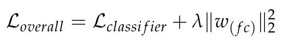
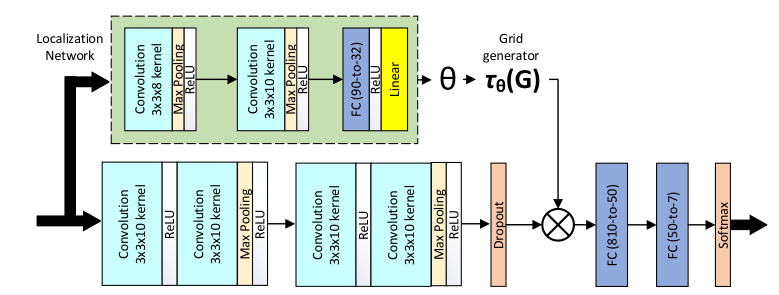
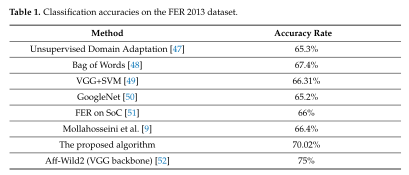
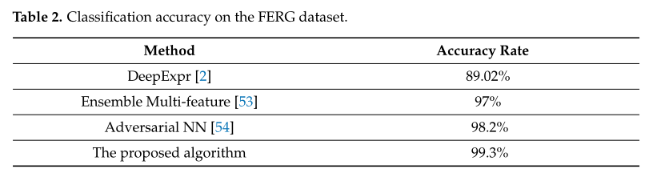
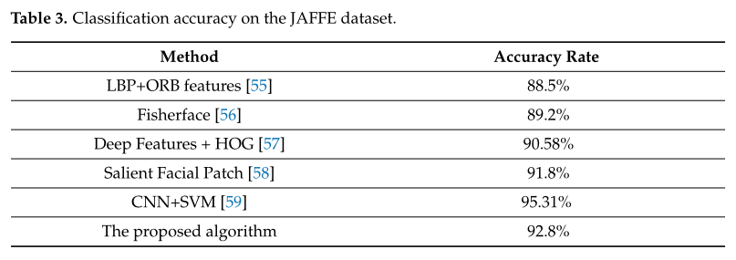
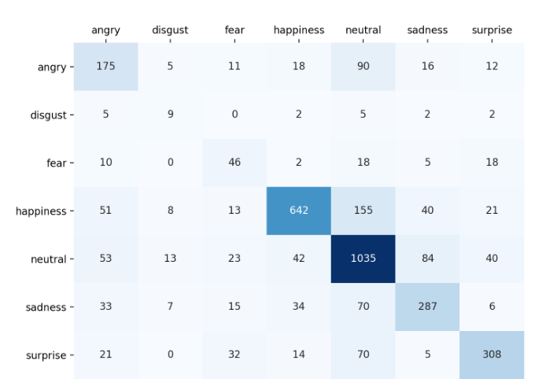

# 深度情感：基于注意力卷积网络的面部表情识别（Deep-Emotion: Facial Expression Recognition Using Attentional Convolutional Network）

**关键词**：卷积神经网络、注意力机制、空间变换网络、面部表情识别

## 传统方法缺陷

1. 传统方法依赖手工制作的特征，导致在图像具有更多变化、任务更困难时，表现不佳。

## 解决方法

1. 基于注意力卷积网络，让网络**聚焦于人脸的重要部位**。

   （在小于10层网络时也能达到非常高的准确率）

2. 一个基于注意卷积网络端到端深度学习框架来分类面部图像中的**潜在情绪**。

3. 注意力机制通过空间变换网络加入框架。

## 新方法的注意点

1. 基于注意力后，发现了**不同情绪对脸部不同部位敏感**。

2. 机器学习框架应该只关注面部的重要部分，对其他面部区域不敏感

3. 损失函数为**分类损失和正则化项之和**。

   

4. 正则化权重根据模型在验证集上的性能进行调整

5. 使用均值为0，标准差为0.05的随机高斯变量初始化网络权重

6. 使用了学习率为0.005的Adam优化器（效果比随机梯度更好）

7. 添加L2正则化，权重衰减值为0.001

8. 重要区域判断步骤：

   - 从图像的左上角开始，每次将N*N的一个区域归零，之后对该图像进行预测，如果预测错误，表明这一块区域较为重要。

   得到**部分结论**：

   - 当遮住嘴巴时，会影响到快乐的识别
   - 当遮住眉毛时，会影响到愤怒的识别

9. 学习率大于0.01会导致发散

## 实验结论

> 模型在厌恶、恐惧等样本较少出错较多
>
> （也可以整合入逆向思维模型）

1. 对特殊区域的检测识别很重要（注意力机制）

## 之前没学过的一些概念：

1. **Haar特征**：

2. 在【40】. Suppressing uncertainties for large-scale facial expression recognition. In Proceedings
   of the IEEE/CVF Conference on Computer Vision and Pattern Recognition文章中提出了一种**简单高效的自治愈网络（Self-Cure Network, SCN）**，可以有效抑制不确定性，并防止深度网络过拟合不确定的面部图像。

   具体来说两个方面

   - 在一个小批量上的自我注意机制，用排序正则化对每个训练样本设置权重。
   - 重新标记机制，会修改组中排名最低的样本标签

3. 在【41】Region attention networks for pose and occlusion robust facial expression recognition中提出了一种新的**区域注意网络**，**对真实世界的姿势和遮挡变化具有鲁棒性**。

4. 【42】 Multiple attention network for facial expression recognition：多重**注意**网络

5. 改进神经网络一般依赖于添加更多层/神经元，促进网络中的梯度流（通过添加跳过层），更好地正则化。

6. **池化的作用**：

   - 可以<u>降低特征图的参数量，提升计算速度，增加感受野</u>。是一种降采样操作
   - 是一种较强的先验，可以使模型更关注<u>全局特征</u>而非局部出现的位置
   - 在降维过程中能保留一些重要的特征信息，<u>提升容错能力</u>，还能在一定程度上起到<u>防止过拟合</u>的作用。

7. 

## 一些想法

1. 把行为数据作为时序数据进行训练

# 基于改进卷积神经网络与支持向量机结合的面部表情识别算法

**关键词**：卷积神经网络、小尺寸卷积核、全局平均池化、非线性支持向量机

## 传统方法缺陷

1. 当前卷积神经网络（CNN）利用端层特征处理面部表情识别存在模型结构繁琐，训练参数过多、识别不够理想的问题。
2. 传统方法主要依赖人工提取特征，需要借助一定的专家知识，<u>人为干扰因素较大</u>，且易丢失原有样本的特征信息，影响表情识别准确率

## 解决方法

1. 对于问题一：

   - 利用连续卷积的思想设计网络模型，获取更多非线性激活；
   - 采用自适应全局平均池化（GAP）取代传统CNN中全连接层，以减少网络参数量
   - 结合SVM分类器代替传统Softmax函数实现表情识别，以提高模型泛化能力

2. 对于问题二：

   **使用卷积神经网络可将原始数据直接传送至模型**。依据端到端的图形拓扑结构自动提取输入数据的抽象特征。

   - 在感受野大小不变的前提下，用**多个结构简单的小尺寸卷积核串联融合**的方式代替大尺寸卷积的作用。

     **优点**：可以在增强模型特征学习能力的同时，拥有较少的网格参数，

   - 

3. 

## 新方法的注意点

1. 

## 实验结论

在网络结构简单、参数里较小的前提下，性能为传统LeNet-5的1.2倍，且具有良好的鲁棒性。

1. 

## 之前没学过的一些概念：

1. 

## 一些想法

1. 

