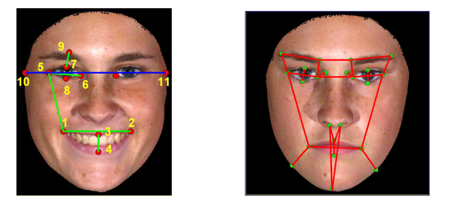
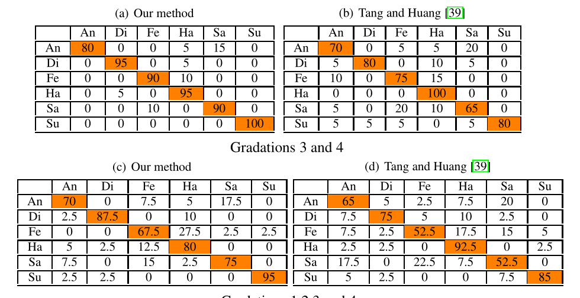
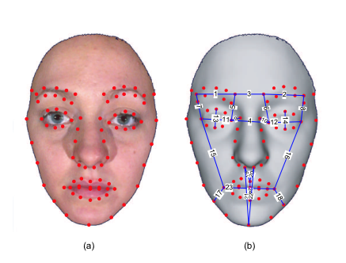
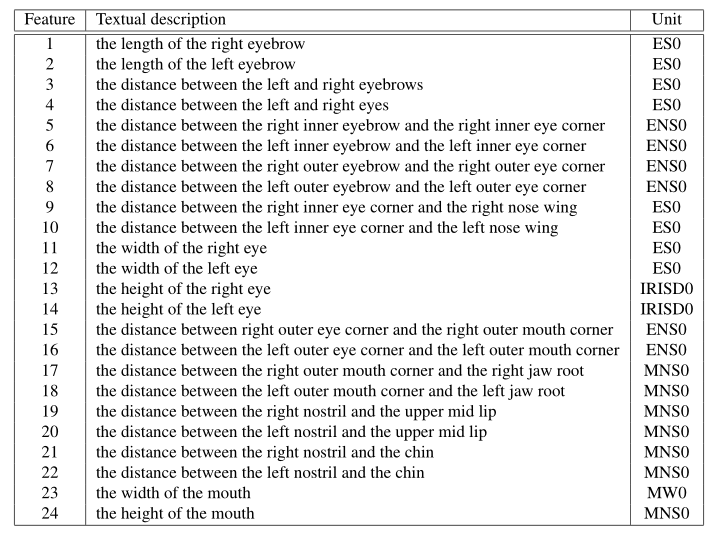
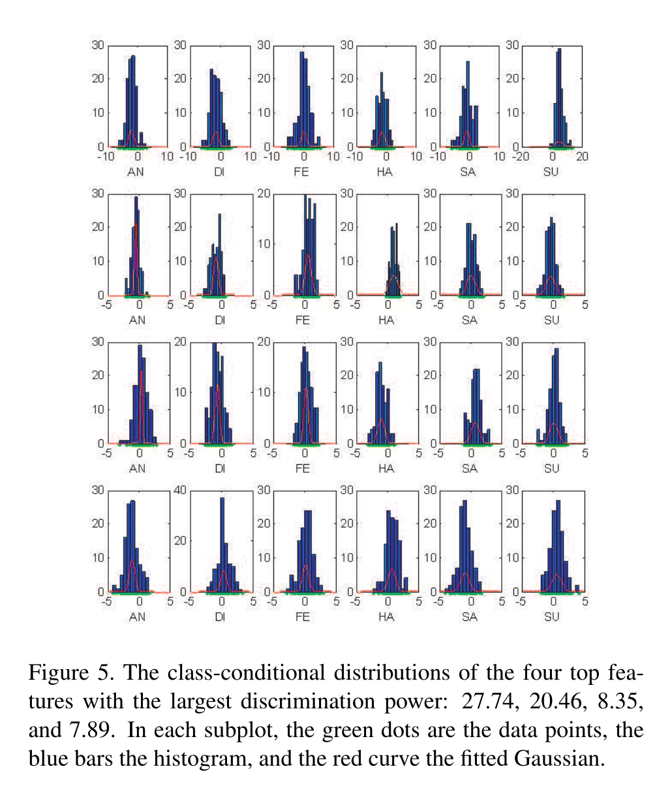

# 利用三维点流进行面部表情识别（Utilizing 3D flow of points for Facial Expression Recognition）

**关键词**：面部表情识别、三维流、三维面部模型、表情强度

## 传统方法缺陷

1. **皮肤运动是三维的**，用二维的人脸图像不能准确捕捉。
2. 
3. 

## 解决方法

1. 提出了一种利用面部**三维点流**来识别不同强度的面部表情的方法

2. 三维流动是指一个面部点从**中性面部到表情面部的几何位移**（可以记录变化的大小和方向）

3. 在**BU-3DFE数据集**上进行（3D数据）

4. 使用四种不同的**强度表达**来分析不同强度表达与FER（Face Expression Recognition）任务的相关性

   分析了低强度表达式的FER性能。

5. 使用SVM进行分类，当只分两个等级强度的表情时准确度91.7。四级时79.2

6. 使用Fisher比率检验 进行特征选择。

## 新方法的注意点

1. 该方法的主要贡献在于**将光流的概念扩展到三维空间**。这样可以包括“**深度信息**”。称其为“**3D流（三维流）**”。

2. 另一个贡献是**分析了面部表情强度对视觉效果的影响**。低强度的面部表情相当于高强度的面部表情温和的表现。

3. 使用全3D信息的一步是 使用**范围图像（一种灰度图像）**。其中每一个像素上的强度值与该像素上的物体深度成正比。

   从距离图像中获得的基本特征向量被称为“**3d经典特征面**”[41]，可以更准确地获取人脸的三维信息。

4. 在本文中将所有人脸模型在**鼻尖处**的坐标原点对齐，再根据边缘对齐（**我的想法是鼻子的最高点和最低点两点对齐，并归一化**）

## 实验结论

1. 高强度表情更容易识别 =》 **有必要开发识别低强度表情的算法**
1. 提出的特征优于 **人脸距离差** 和 **二维光流**

## PPT讲解：

1. 

## 之前没学过的一些概念：

1. **BU-3DFE数据集**：

2. 人的情绪可以通过不同的方式来表达，如<u>面部表情、言语、肢体工作</u>等。

   在这些中，（**怎么得到的结论？**）

   - 面部表情约占55%
   - 语音语调约占38%
   - 口语占7%

3. FER最开始是基于2D图像数据进行识别的，基于图像视频的标准方法之一就是在**FFPs（Facial Feature Point）处的光流分析**。一个点的光流即该点从一帧到下一帧的位移。

4. 三维人脸模型可以从不同视角的人脸视频重建。这种技术被称为“人脸重建”。

   使用基于实例的方法、立体方法、基于视频的方法和基于轮廓的方法来获得人脸地标点的三维位置参考一个固定的原点。

1. 

## 未来的方向

1. 需要平静图像，需要思考如何解决获取平静图像问题

## 一些想法

1. 本文中提到“优于人脸距离差”看相关论文，了解什么是人脸距离差

2. 【39】中提出了以中性脸为参照，从其变化形式。

   **缺点**：使用差异特征可能无法解决FFP运动方向捕获的模糊性。

3. 看有关于2D optical flow（2d光流）的文章

4. 【31】分析了特征选择对算法性能的影响

1. 大多数方法都使用了**训练多分类器**的方法。

# 基于特征自动选择的三维面部表情识别（3D Facial Expression Recognition Based on Automatically Selected Features）

## 传统方法缺陷

1. 

## 解决方法

1. 基于边缘类条件特征分布平均相对熵最大化的自动特征选择方法。

2. 将其应用于由83个面部特征点之间的归一化欧式距离组成的完整候选特征吃。

3. 使用**正则化AdaBoost**分类算法：

   文中使用的正则化包括

   - 最近邻（NN） =》 93.6
   - 朴素贝叶斯（NB） =》 93.8
   - LDA线性判别 =》 91.8

4. 

## 新方法的注意点

1. 根据3d人脸面部表情原始模型，裁剪真实感三维人脸网格模型，一对纹理图像与two-angle视图（-45°和45°）。

   在本篇文章中只使用裁剪后的面部，并提取83个特征点。

   

2. 从83个特征点，提取出包含24个值的特征集（不同点子集之间的标准化距离）。

   

3. **提取有效特征**：从一个比较容易搜集的大量候选特征库中，提取

   - 从贝叶斯的观点来看，特征向量DP(x)的鉴别能力取决于x的**类条件分布**中有多少鉴别信息。类条件分布表现出的差异越大，x中的判别信息越多。
   - 其中一个很好的“度量”是相对熵，即Kullback-Leibler散度

4. 公式推导过程中的一些结论：

   - 一组独立特征的辨别能力，是个体特征辨别能力之和

     =》 特征选择的一种合理方法是只保留那些区分度最高、对所选特征集的总区分度贡献最大的特征。

     =》 可以只保留少部分特征

   - 

5. 提出以人脸**两个外眼角之间的距离**为基准进行标准化。

   寻找重要特征。最后发现10~30个特征足以产生良好的分类效果。

   

1. 

## 实验结论

平均识别率为95.1%。对惊讶表情的平均识别率最高为99.2%

## 之前没学过的一些概念：

1. 【2】中证明了，使用3D面部特征可以更准确分类（但是我做的是2D）
   **疑问**：实际过程中，可以用多方向摄像头进行3D面部建模？

2. **Kullback-Leibler散度（相对熵）**：

3. **AdaBoost**对<u>解决过拟合</u>有作用，但是<u>对噪声和离群值较为敏感</u>。

   如果存在异常值，会导致弱分类器关注异常值。

   **解决方案**：抛弃异常值，强制弱分类器关注有意义的数据

   **具体实现**：该实现在本文中被称为“<u>AdaBoost正则化</u>”

   - 如果连续几轮训练中，有一个例子被错误分类，则认为其是一个离群值。
   - 如果这个离群值的当前权重超过一个阈值，那么将其权值设置为0（丢弃这个离群值）

4. 

## 未来的方向

## 一些想法

# 用于面部行为研究的3D面部表情数据库（A 3D Facial Expression Database For Facial Behavior Research）

## 传统方法缺陷

1. 

## 解决方法

1. 

## 新方法的注意点

1. 

## 实验结论

## 之前没学过的一些概念：

1. 

## 未来的方向

## 一些想法

