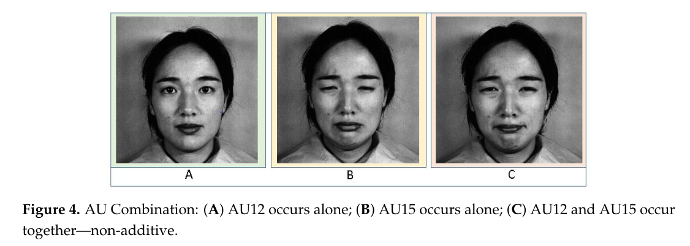
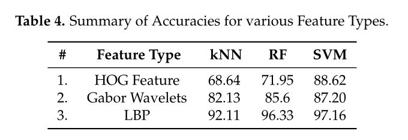
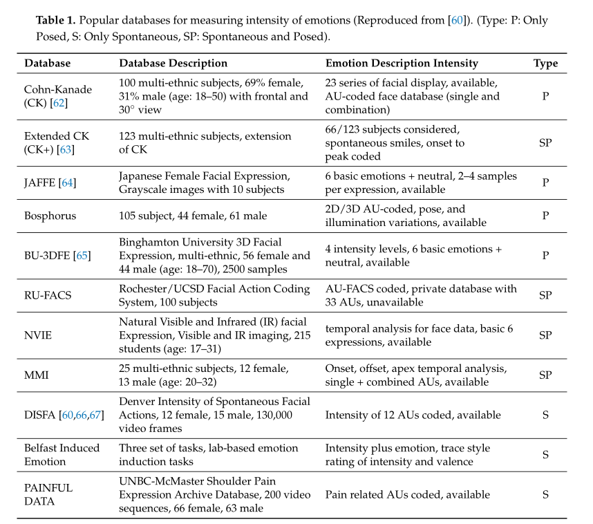
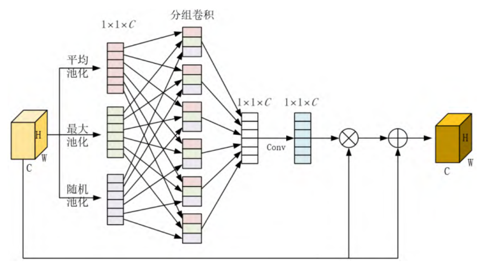

# 使用机器学习算法识别情绪强度：一种比较研究（Recognition of Emotion Intensities Using Machine Learning Algorithms: A Comparative Study）2019

**关键词**：面部情绪自动识别、情绪识别强度、行为生物特征识别系统、机器学习

## 传统方法缺陷

1. 现有的研究工作通常没有对观察到的**面部情绪强度**进行编码，也很少涉及对**多类面部行为数据的联合建模**。

2. 从自发/姿势的面部表情检验**表情强度的研究被严重忽视**

3. 从单一的帧中测量AUs的强度是很难的，因为AUs的出现非常随机，没有组合关系。（可能出现在完全不同的表情类别里面）

   

   FACS手册中提到：所有的AUs的内在关系可以细分为两个类：

   - 互斥类：（嘴唇分开、嘴唇紧闭）
   - 共现类：一组AUs通常一起出现

4. 

## 解决方法

使用的算法：

- Gabor滤波器

- 梯度直方图（HOG）

- 局部二进制模式（LBP）

  当一个二进制串匹配时，只有两个或更少的位不一样时，认识是相同的二进制串

  否则认为是不同的

使用的分类器：

- SVM
- RF（随机森林）
- 最近邻算法（kNN）

使用以上技术在目前流行的五种数据库（BD-3DFE、DISFA、CK、JAFFE、一种作者自己的）进行比较

提出了一种基于不同的AUs（Action Units）的面部情绪及其强度测量算法的比较和研究

第一层：**训练层：**

1. 图像的输入和排序
2. 预处理（数据增强、转换成灰度图、降噪）
   - 人脸图像配准和表示、降维、特征提取和分类
   - 表示和捕获语义AUs关系，以及AUs强度之间的相关性
3. 使用LBP、Gabor、HOG等特征提取算法，然后拼接成最终的特征向量
4. 使用降维方法，去除不需要的特征（使用拉普拉斯特征映射算法来降低数据的维数）
5. 使用SVM、RF、kNN等分类算法对AUs进行分类

第二层：**测试层**：

1. 和训练层一样进行预处理（排序、预处理、特征提取和选择）
2. 将这些特征通过训练模型进行传递
3. 基于AUs做出情感强度决策

## 新方法的注意点

1. 多类分类器的假设前提是**强度的排名是相互独立的**，所以用于分类“强度”没能很好地提高性能

## 实验结论

证明了情绪强度可以**进一步在现实世界中应用**

LBP-kNN检测几乎对所有AUs精度都很高

LBP-SVM能够更好地识别所有强度水平的情绪

## PPT讲解：

1. 

## 之前没学过的一些概念：

1. 情绪的强度通常与**面部肌肉运动的强度**直接相关

2. 近年来对于情绪强度检测领域主要的研究领域：

   - 第一个领域与**跨文化特征**有关

     **结论**：不同文化之间在面部表情识别方面高度一致（**跨文化一致性**）

   - **第二个研究结论**：**性别**对**非语言信号**的解读和预测能力存在**较大差异**

   - 第三个领域，基于五种基本情绪，以发现**精神分裂症、自闭症和边缘性人格障碍**等疾病中情绪强度的主要错误模式和影响。

3. **身体、智力上有障碍**的人在表现情绪时是**不理智**的，需要**另外一种标准**来感知他们的情绪状态。

   可以用技术检测、挖掘他们被抑制和隐藏的情绪。

4. 情绪也可以用于**教育领域、网购、游戏交互、检测嫌疑人意图、风险预防、智能保健**

5. 文中说的一些流行的数据库表：

   

6. 看【95】，提出了一种使用多维连续面部情感数据的内在拓扑方法。

   - 首先用有序流对数据进行建模
   - 再用动态有序回归

7. 实际应用时，由于数据库中缺乏角度的变化、光照问题等问题，还不够成熟

8. 从技术上讲：

   - **Gabor滤波器是最接近人类视觉感知系统**的
   - LBP在**计算上更简单**、在**各种光照下工作地更好**
   - HOG具有使用不同的块大小和直方图箱**数量的优势**

9. SVM通过超平面分离训练数据的能力，将输入非线性映射到<u>高维特征空间</u>，具有**泛化**能力

10. kNN在噪声情况下效果好，SVM用于线性不可分数据，RF用于类别特征

11. 

## 未来的方向

1. 可以设计一些方案 专门处理 识别情绪强度时的一些问题（头部倾斜、角度等）

## 一些想法

1. 文中提到，3D人脸图像的研究是最彻底的【4-7】
1. 【9-11】最近的一些综述文章（可以看看）
1. 文中提到了不同程度的情绪，识别成功率不同（可以应用第二周中的逆向思维模型）
1. 可以想办法找一个方法检测男女的情绪（文中提到**男性女性**处理不同的情绪信息**表现不同**）
1. 本文中提到的方法**准确率非常高**

# 基于多尺度融合注意力机制的人脸表情识别研究 2021

**关键字：**计算机视觉、深度学习、人脸表情识别、特征提取、多尺度特征融合、注意力机制

## 传统方法缺陷

1. 传统卷积神经网络在特征提取阶段容易**丢失大量有用信息**，导致表情识别率低
1. 早期人脸表情识别算法主要基于**人为设计的特征提取方法（LBP、HOG等）**，会受到研究人员先验知识的限制，泛化性不足。
1. 

## 解决方法

提出一种基于多尺度特征融合注意力机制的人脸表情识别方法：

1. 采用**VGGNet16**提取卷积特征
2. 将网络中不同层次卷积层的输出特征图进行**多尺度特征融合**（引入上下文信息的同时可以提取更加丰富的表情特征信息）
3. 引入**注意力机制**，利用**分组卷积操作**，学习不同通道的权重信息，获取注意力特征图（增强特征的表达能力，抑制冗余信息的影响）
4. 引入**孤岛损失函数**，并与**Softmax分类损失函数联合使用**构成新的损失函数
5. 在卷积层**引入DropBlock**策略（防止过拟合）

## 新方法的注意点

1. 在SENet的基础上，添加**平均池化和随机池化**

   

2. Softmax对**类间间距优化效果明显**，但对于人脸表情这种**同一类表情不同样本之间存在较大差异**的情况容易**产生错误判断**。

   **解决方式**：通过引入Island loss，通过两者联合使用，实现增大类间距离的同时减小类内距离

1. 使用**双线性内插值算法**进行尺度归一化

## 实验结论

效果更好

## 之前没学过的一些概念：

1. 深度神经网络**不同层次提取到的特征信息**会存在**较大差异**

   **浅层网络：**提取到的特征包含大量图像内容的**细节信息**

   **深层网络：**提取到的特征包含大量高层次的**语义特征**

1. 

## 未来的方向

进一步优化网络结构、提高检测效率。

使用更接近自然环境的数据集，提高在实际应用中的价值

## 一些想法

1. 

# 基（F）

## 传统方法缺陷

1. 

## 解决方法

本

## 新方法的注意点

1. 

## 实验结论

## 之前没学过的一些概念：

1. 

## 未来的方向

## 一些想法

