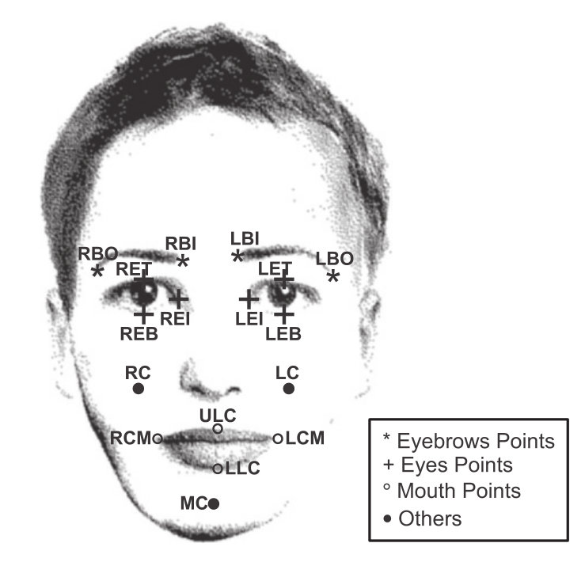
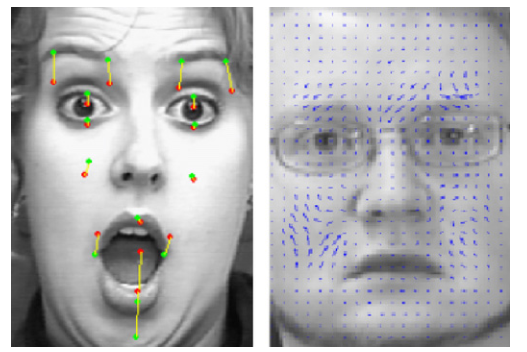
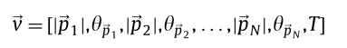
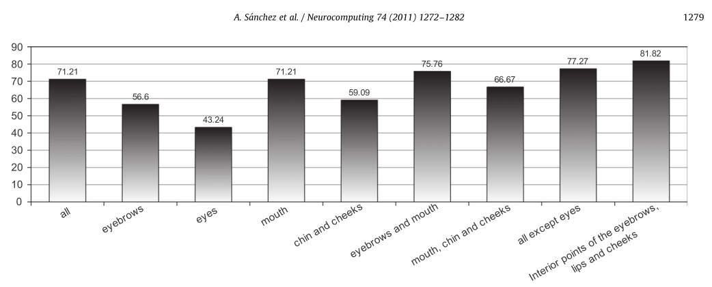
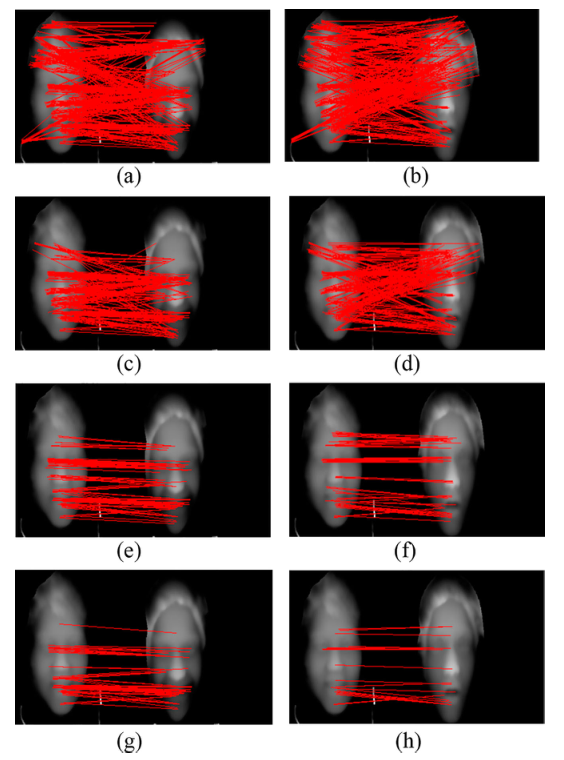
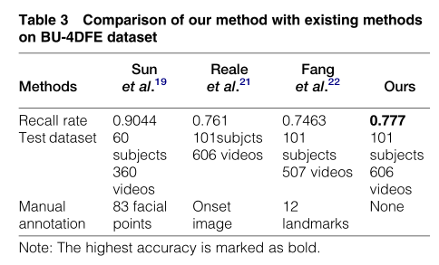

# 用于人脸表情自动识别的差分光流技术（Differential optical flow applied to automatic facial expression recognition）

**关键词**：面部表情分析，光流法，面部特征点，表情运动抽取，支持向量机

## 传统方法缺陷

1. 

## 解决方法

文章中系统地比较了两种基于光流的人脸表情识别方法：通过计算从中性到带表情图像的特征点唯一

- **特征点跟踪**：是特征化的，即选择一组经过简化的高度鉴别的**人脸特征点**。
- **整体人脸密集流跟踪**：是整体化的，在**中心脸部区域**使用更多的**均匀分布点**

使用了两种数据集：

- cohn-kanade：分别使用了原始分辨率和40%分辨率 在六种典型表达式上进行了算法评估

  **在该数据集下的结论**：原始分辨率下，密集流跟踪方法性能好于特征点跟踪

- mmi：在mmi数据集上显示出了**更高的变异性**。

  **在该数据集下发现两种方法性能类似**

#### **提出的面部表情识别系统：**

使用两个**跟踪策略**：

1. 基于特征，考虑15个特征点的运动
2. 整体的，利用密集且均匀分布在以中心人脸区域为中心的网格上的人脸点的位移

系统由四个部分组成：

1. **预处理**：
2. 特征点根据
3. 密集流跟踪
4. 面部表情分类：使用SVM

##### 预处理：

1. 手动选择内眼角点作为一个参考矢量

2. 利用两个内眼角点进行归一化，并进行角度校正。

3. 提取15个特征点（包括眼镜、眉毛、嘴部）

   （特征点选择的依据是：这些点在不同的表情上会发生显著位移。以及他们与周围区域有一个高强度对比）

   

   

4. 将特征点前后变化组合成一个包含31个分量的全局特征向量

   

5. 对于密集流，先在脸部中心区域采样特征点，使用高斯金字塔减少到1/16。

6. 对于Cohn-Kanade数据集，由于数据分布不均匀会影响模型的性能，因此从中筛选出部分数据。

## 新方法的注意点

1. 

## 实验结论

1. SVM使用三种常见的核函数（多项式、高斯、s型），最终发现使用高斯函数性能最好，77.65

2. 使用40%分辨率的图像可以加快运算。

3. 所有情绪中识别准确度最高的是“悲伤”，最差的是“恐惧”

4. 密集流跟踪方法精度**明显好于**特征点跟踪方法

5. 嘴巴+眉毛+脸颊点组合的识别效果最好（81.82）

   

1. 

## PPT讲解：

1. 

## 之前没学过的一些概念：

1. **Cohn-kanade数据库**：提供了受试者皮肤颜色的可变性以及光照条件的微小变化

   包含约100名受试者，年龄在18~30之间，以及多种肤色

2. **mmi数据库**：是一个更新的数据库（相较于1而言），包含静态图像和视频，包括姿势和自发的表情

   开发人员称：是2010年为止最全面的面部行为记录数据集

   52名不同男女受试者，19~62岁，多种族。

   **注**：当部分面部遮挡时（如眼镜、胡须或帽子），表情幅度会更大。

3. **面部动作单位（AUs）**：对应于与特定面部肌肉相关的局部面部特征的细微变化。（嘴角下压等），这些形成了面部动作编码系统（FACS）

   **注**：这是对可能的面部动作或变形的分类，和情绪无关

4. **JAFFE**：

5. **Belfast自然情感数据集（Belfast Naturalistic Emotional database）**

6. **AFEA（Automatic Facial expression analysis）**：自动面部表情分析

7. DFT方法：（密集流跟踪）

   **优势**：识别精度不降低的同时，手动标记的点更少

7. 

## 未来的方向

1. 在序列的第一帧中自动检测考虑的预处理和特征点
1. 分类额外类型的情绪以及不同强度的表情

## 一些想法

1. 【20】中将模拟面部变化的面部特征分为“**变形特征**”和“**运动特征**”

   - “变形特征”不考虑像素运动的信息，可以从静态图像中获得
   - “运动特征”主要集中于面部运动，并应用于视频序列。

   相关技术有：运动模型【21】，差分图像【20】，标记跟踪器【22】，特征点跟踪【12，23】，密集光流【24】

   **优点：**光流与运动模型的集成可以提高系统的稳定性，改善了面部运动节食和相关的面部表情分析

2. 看【26】利用面部特征点位移作为**HMMs**输入参数，实时有效地识别基本面部表情。

3. 【27】模拟面部表情

4. 找到本篇论文的代码

1. 【30】中应用了RBF神经网络

# 基于时空兴趣点的深度序列人脸表情识别（Facial expression recognition based on spatio-temporal interest points for depth sequences）2016

**关键字：**深度序列、面部表情识别、时空兴趣点、梯度方向直方图、光流直方图、匹配对

## 传统方法缺陷

1. 在之前提出的方法中，大多数是基于2D纹理帧或序列的。导致准确的识别受到一定的光照和姿势的限制。

## 解决方法

1. **深度传感器**的发展为处理三维数据提供了新的可能性。

   直接从深度序列中提取**STIPs（Spatio-tempotal interest points）**的定向梯度直方图和光流直方图

   不是通过配准/变形技术来寻找对应关系

1. 在naive-Bayes互信息最大化和约束匹配对的基础上，分别计算**互信息评分（MIS：Mutual information score）**和**加权匹配评分（WMS：weighted matching score）**。

1. 最后，将MIS和WMS结果连接成特征向量，然后将特征向量输入支持向量机进行面部表情分类。

1. 最后得到的这个实验结果简单有效。

## 新方法的注意点

1. 将网格顶点转换为深度帧，并直接从深度序列中提取**STIPs（Spatio-tempotal interest points）**的定向梯度直方图和光流直方图。

   **优点**：免去通过配准、变形技术寻找对应关系的过程。可以减少大量计算

2. 提出了两种匹配分值：互信息分值（MIS）和加权匹配分值（WMSs）。

   **优点**：可以提高识别能力

3. 通过支持向量机将MIS和WMS进行融合

   **优点**：可以提高识别精度

**在两个面部表情深度序列之间获取有效的STIP匹配对**

1. 先提取匹配对

   

2. 通过一些约束剔除无效匹配对

   - 基于区域：只有当两个点的坐标都在单独一帧的面部区域内
   - 基于特征：属于相同的特征（都是鼻子）
   - 基于分割：当两个点属于相同的段（设置一个固定大小的滑动窗口，使用窗口扫描，若两个点可以被窗口包围，则保留）

   

3. 

## 实验结论

## 之前没学过的一些概念：

1. 
   

## 未来的方向

## 一些想法

1. **BU-3DFE数据集**：
2. **BU-4DFE数据集**：
3. 只有当脸的**下半部分**出现时才能可靠地检测到**快乐**
4. 看【12】，感觉和我的想法差不多。
5. 看【20】，提出了一种可靠的人脸还原技术
6. **NBMIM（评价指标？）**
7. 近期公开的人脸数据集：SALDB、Belfast Induced Natural Emotion Database，DISFA、BP4D-Spontaneous（第一个有良好的注释、动态3D视频数据库自发面部表情）

# 用（A）

## 传统方法缺陷

1. 

## 解决方法

1. 

## 新方法的注意点

1. 

## 实验结论

## 之前没学过的一些概念：

1. 

## 未来的方向

## 一些想法

