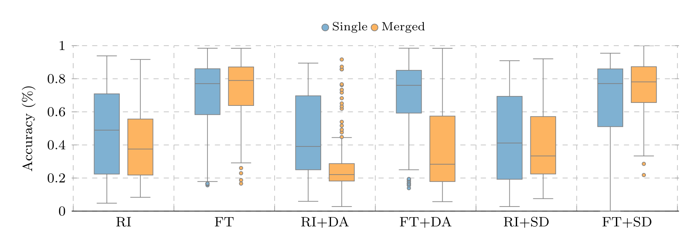

# 有限数据学习的缺陷:一个面部表情识别案例研究（On the Pitfalls of Learning with Limited Data: A Facial Expression Recognition  Case Study）2021

**关键词**：有限数据学习，有限数据，视频分类

## 传统方法缺陷

1. 深度学习模型需要**大量的数据**进行训练，在处理小数据集的时候通常会加强数据。

2. 使用迁移学习（预训练）和更多生成数据进行训练时，**复杂数据集**可以更好地转化为**更稳定的数据集**，但是**性能存在较大方差（调参的差距）**

3. 更多数据的训练可以在新样本下有更稳定的表现（性能会降低）

4. 合并异构数据需要考虑 **增加和初始化的类型**，所以不简单

5. 传统的数据增强方法**无法填补**大量**离散**数据集造成的**漏洞**。（视频）

6. 当与合成数据配对时，归纳偏差有助于弥补差距，但当使用标准初始化技术时，这些数据是不够的

7. 以前的研究没有研究**多个数据集或多个架构**，关注于自己的任务，**没有去理解技术和有限数据的整体影响**。

8. 绝大多数文献的贡献只关注测试集上的性能，不考虑在其他领域的泛化？？？

   应该跨数据集验证（迁移学习？）

9. 

10. 

## 解决方法

本文中探讨了**堆叠数据库**（多个数据集合用？）、**模型初始化**和**数据放大**技术在有限数据训练时对深度学习模型性能的影响。

重点研究了“**视频中的面部表情识别问题**”

对“**四个不同复杂度的数据库 和 九种深度学习架构**”进行了研究

提出了一种通过**有限数据的镜头**进行面部识别的问题。还简要介绍了通过这一镜头处理该问题的现状。

**实验步骤：**

- 使用不同的初始化：xavier、微调
- 不同类型的数据增强（经典，GAN）
- 使用跨数据集的方式测试泛化性能
- 数据集：CK+，MMI，MUG，OULU-CASIA

**参与比较的模型：**

1. 二维卷积LSTM架构
2. 三维卷积神经架构
3. 基于LSTM的三维卷积架构

视频中的内容为：从中性表情变为有表情，再从表情变回中性

## 新方法的注意点

1. 本文是首次研究视觉任务的迁移学习影响、数据集堆叠、数据扩充及其组合
2. 选择视频数据的原因：
   - 视频数据条件差异大（姿势表情、照明等），有强异构性（不同视频之间离散）
   - 
3. 

## 实验结论

主要结论和所用数据集的特征有关

1. 训练集的复杂性会影响学习模型的性能，复杂性与增加数据的方法相关
2. 复杂的训练集在**迁移学习和合成数据生成器的作用下效果更好**，代价是**结果方差较大**
3. 更直接的数据集产生更稳定的结果，且不考虑增广时，性能低于微调（预训练）
4. 合并、堆叠数据集不一定是一种改进。合并后的数据可能会**出现更多的“漏洞”**。为了避免这些，需要**小心地初始化和扩充数据**
5. 本文观察到了上述的缺陷，避免了这些问题。
6. 合成数据配对时，归纳偏差有助于弥补差距。

single：单一数据集，merged：合并的数据集

RI：随机初始化，FT：预训练模型

DA：经典数据增强，SD：生成数据增强

以上可以得到的结论：

1. 所有具有FT的都比任何具有RI的更好
2. 增强方法与RI无关（使用RI时，数据加不加都一样）
3. 在数据增强技术上，FT表现出更加异构的行为？

**模型初始化：**

初始化方法对结果有很大影响：当使用RI时，与FT相比，模型性能更低，结果方差也更大。

对于FT，DA有时候甚至会让模型变得更差

DA降低了模型的准确性，SD增大了模型的方差。且SD性能更好

多数情况下，合并数据库会增加模型性能，方差也会更大

对于FT+SD+合并数据库 性能一般会比合并前要好

**最终结论：**

1. 预训练模型很优秀（大数据集）
2. 叠加数据集不一定是改进
3. 跨数据集时，通过仿射变换生成的数据，无助于真实世界任务，反而会导致数据库过拟合。
4. 数据库堆叠时，用GAN增强比较好。
5. 

## PPT讲解：

1. 

## 之前没学过的一些概念：

1. 可以用GAN来对数据进行语义增强，减少模型的过拟合，解决数据缺乏问题。（但是小数据训练GAN也是个问题）

   下面这篇论文应用迁移学习技术在数据有限的情况下对GAN进行训练

   **论文：**Zhao, M., Cong, Y., & Carin, L. (2020). On leveraging pretrained GANs for limited-data generation.Inter. Conf.
   Mach. Learn. (ICML).

2. Karras, T., Aittala, M., Hellsten, J., Laine, S., Lehtinen, J., & Aila, T. (2020). Training generative adversarial networks
   with limited data.arXiv preprint arXiv:2006.06676.

   上论文提出了用有限数据训练生成GAN

3. 面部重建论文：

   Aberman, K., Wu, R., Lischinski, D., Chen, B., & Cohen-Or, D. (2019). Learning character-agnostic motion for motion
   retargeting in 2d.ACM Trans. Graphics,38(4), 1–14

   

   Nirkin, Y., Keller, Y., & Hassner, T. (2019). FSGAN: Subject agnostic face swapping and reenactment.IEEE Inter.
   Conf. Comput. Vis. (ICCV).

   

   Wu, W., Zhang, Y., Li, C., Qian, C., & Change Loy, C. (2018). ReenactGAN: Learning to reenact faces via boundary
   transfer.European Conf. Comput. Vis. (ECCV).

   

   Zakharov, E., Shysheya, A., Burkov, E., & Lempitsky, V. (2019). Few-shot adversarial learning of realistic neural
   talking head models.arXiv preprint arXiv:1905.08233

   

1. 

1. 

   

## 未来的方向

**总结：**

1. 最

## 一些想法

1. 
1. transformer：目标检测【27】，分隔【27， 69， 70】，去噪【71】，超分辨率【71， 72， 73， 74】

# 基 2021

**关键字：**计

## 传统方法缺陷

1. 

## 解决方法

提出一种基于多尺度特征融合注意力机制的人脸表情识别方法：

1. 

## 新方法的注意点

1. 

## 实验结论

效果更好

## 之前没学过的一些概念：

1. 

## 未来的方向

进一步优化网络结构、提高检测效率。

使用更接近自然环境的数据集，提高在实际应用中的价值

## 一些想法

1. 

# 基（F）

## 传统方法缺陷

1. 

## 解决方法

本

## 新方法的注意点

1. 

## 实验结论

## 之前没学过的一些概念：

1. 

## 未来的方向

## 一些想法

