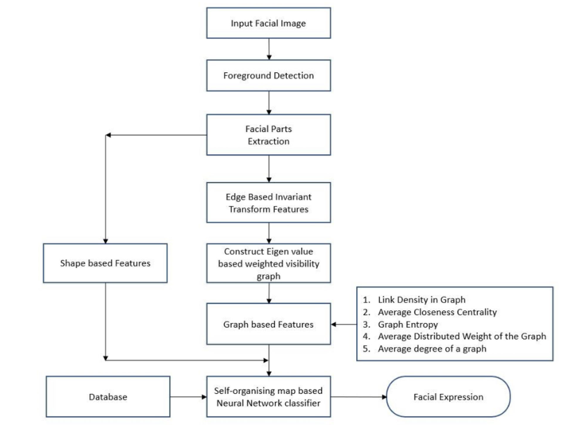
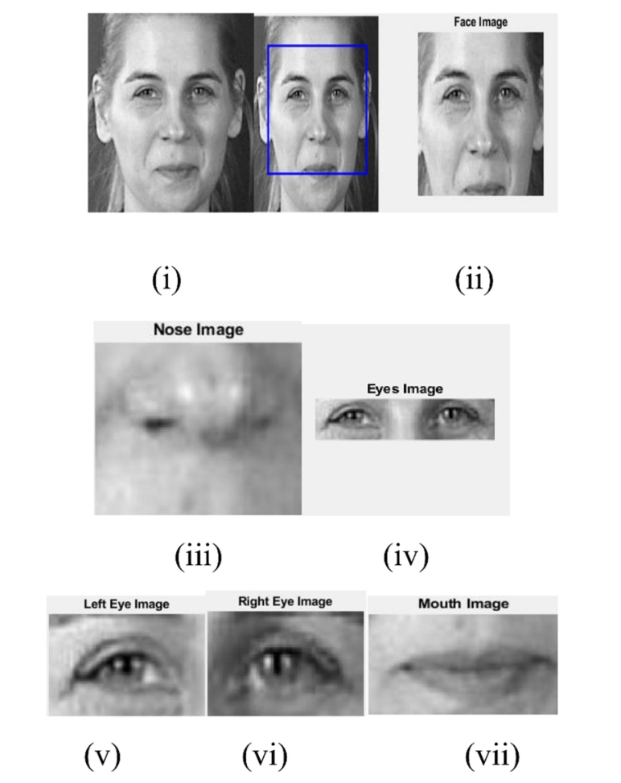
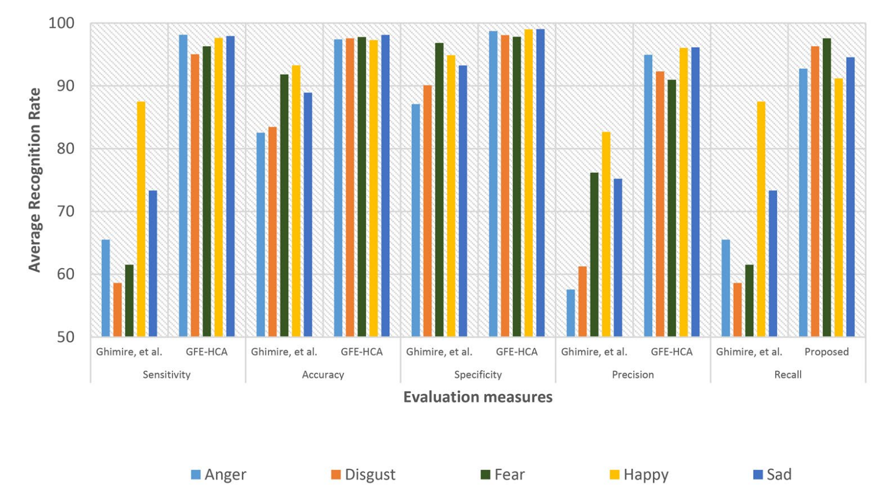
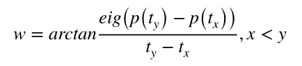

# 基于图的特征提取和混合分类的人脸表情识别方法（Graph based feature extraction and hybrid classification approach for facial expression  recognition）

**关键词**：人脸表情、情感识别、加权可见图、基于自组织映射的神经网络

## 传统方法缺陷

1. 虽然目前已经有多种算法可以对面部表情进行识别，但是**识别不准确**。

2. 恐惧或悲伤等情绪的识别是一个挑战

3. 一种基于**多层次Haar小波**：用于从<u>不同尺度的明显人脸区域中提取外观特征</u>

   最初，该方法利用Viola-Jones级联对象检测器分隔最有信息的几何元素，如眼镜、眉毛、嘴巴。可以找到分段元素的Haar特征。

   然后采用一对多Logistic回归模型进行分类。

   **优点**：计算简单，有助于有效地表示低维呈现的信号。

   **缺点**：在动态图像中很难识别表情。

4. 

## 解决方法

提出了一种基于**图的特征提取与混合分类（GFE-HCA）**方法：

1. 使用**Viola-Jones**算法识别人脸
2. 从检测到的人脸图像中提取出**右眼、左眼、鼻子和嘴巴等面部部位（可以用上）**。
3. 利用**基于边缘的不变变换特征**从提取的面部部位提取特征。在此基础上使用**加权可见图**优化维数，生成基于图的特征。
4. 提取基于**形状特征**的人脸特征
5. 从这些提取的特征，面部表情识别和分类使用一个基于**自组织映射**的神经网络分类器。

从**特定视频序列中识别人脸图像的总体流程**：

1. 对于一个输入的人脸图像，使用Viola-Jones算法检测前景图像，提取面部区域（相比其他的技术，该算法可以更准确更快地检测人脸区域）
2. 提取眼睛、鼻子、嘴巴等面部部位
3. 根据**人脸部位的形状外观**提取形状外观特征，采用**基于边缘的不变变换**进行边缘特征提取
4. 利用提取的基于边缘的不变变换特征，构造**基于特征值的加权可见性图**。
5. 从构建的图中提取出**图中的链接密度、平均贴近中心性、图熵、图的平均分布权重和图的平均度**等特征
6. 借助基于自组织映射的神经网络分类器进行分类。

## 新方法的注意点

1. **基于边缘-不变的变换**：

   - **边缘**：数字图像中强度突然偏离的一点

   通过提取不变特征来预测情感之间的唯一性。

   1. 应用**Canny边缘检测器**（目前应用最广泛的边缘检测算法之一）机制，通过预测边缘区域来初步提取人脸部分。
   2. **估计**各个部分的**滤波系数**，并使用面部每个部分的滤波系数来**预测角点**
   3. 通过检测到的角点**估计不变特征**，最终识别出区域、像素和点
   4. 通过Harris点检测计算图像中的关键点。

   > 注：不变变换依赖于执行物体的外观，不受缩放和旋转的影响。
   >
   > 且表示检测不同情绪之间的变化

2. **加权可见图**：可见图具有将<u>基于边的不变特征表示为基于图的特征</u>的性质

   继承了特征数据所在位置的动态特征。

   **构建一个图**：

   若两个点之间存在边，则表示两点之间存在关联。

   只有在两个点之间存在可见性时，节点之间才可能有关联。
   $$
   P(t_{x})：t_{x}位置上的特征点
   \\
   P(t_{y})：t_{y}位置上的特征点
   \\
   P(t_z)：t_z位置上的特征值
   \\
   t_x，t_y表示时间事件
   \\
   t_z表示它们之间存在的事件
   $$
   需要确定两个节点之间形成的链接的边权值。（边权信息的保留有助于获得复杂网络的鲁棒性结果）

   丢弃弱边、不太重要的边。
   $$
   G(V_{ij}, E_{ij}, w_{ij})：有向图
   \\
   w_{ij}表示E_{ij} \to R的加权函数
   \\
   n_x \to n_y，x \lt y
   $$
   

   eig()：求特征值的函数

   **算法步骤**：

   - Step1: Estimate the weight for the formed edges using equation（用公式估计成形边的权值）
   - Step2: Link Density in Graph（图中的链接密度）
   - Step3: Average of Closeness Centrality（接近中心的平均值）
   - Step4: Graph Entropy（图像熵）
   - Step5: Average Distribution Weight of the Graph（图的平均分布权重）
   - Step6: Average degree of a graph（图的平均度数）

3. **基于形状的特征提取**：眼睛、鼻子、嘴巴等。主要关注<u>面部各部分的高度和宽度</u>

4. **基于自组织映射的神经网络分类器**：

   自组织映射是一种**前馈结构**，具有一个按行和列排列的神经元计算层。

   - 在训练阶段，估计类中每个特征的**平均阈值**
   - 对属于同一类的特征进行处理，为每个特征集计算**成对距离**。
   - 根据特征之间的距离计算指定类别的密度，根据估计的距离，确定**每个类别的等级**。
   - 根据确定后的等级，确定**梯度**
   - 基于梯度，进行质心计算。
   - 在测试阶段，通过相同的阈值、成对距离和质心计算操作来处理测试特征。
   - 在验证阶段，应用训练阶段和测试阶段中更新的特性，通过训练的网络进行预测。

## 实验结论

1. 提出的方法对“愤怒”，“快乐”、“悲伤”情绪提供了更高的特异性结果。对“恐惧”的特异性较低
2. 情绪“恐惧”和“悲伤”准确率提高，超过94%
3. 对“快乐”、“悲伤”情绪给出了更高的精度结果
4. 对“恐惧”给出了更低的精度

## PPT讲解：

1. 

## 之前没学过的一些概念：

1. **Viola-Jones算法**：
2. Nanni et al. 2017提出了用于从**有向变缘幅值（POEM）描述符模式中识别面部表情**：
3. 看：Liu Y, Li Y, Ma X, Song R (2017) Facial expression recognition 
   with fusion features extracted from salient facial areas. Sensors 
   17(4):712
4. 看：Valstar  MF,  Sánchez-Lozano  E,  Cohn  JF,  et  al.  (2017)  Fera 
   2017-addressing head pose in the third facial expression recog-
   nition and analysis challenge. In: 2017 12th IEEE international 
    conference on automatic face & gesture recognition (FG 2017). 
   IEEE, pp 839–847
5. 看：Suk M, Prabhakaran B (2014) Real-time mobile facial expression rec-
   ognition system-a case study. In: Proceedings of the IEEE con-
   ference on computer vision and pattern recognition workshops, 
   pp 132–137
6. 自组织特征映射神经网络：https://blog.csdn.net/xbinworld/article/details/50818803

**特征提取**：

- 通过**常见区域**和**特殊区域**来区分总体表达式和具体表达式。
- 针对不同区域的定位问题，采用**两阶段多任务稀疏学习方法**。在这种方法中，**所有的表情都有主要的区域**。结合相关的面部表情识别和面部验证任务，对个体表情中特殊区域进行分析。提供了更好的性能。

​    提出了一种**新的特征提取背景**，有助于将**面部表情的差异表示为局部基函数的线性混合**：

- ​    使用从面部视频计算的Gabor相移来训练稀疏线性模型。（有助于获得预期框架的线性基函数，解决了泛化的困难）通过识别姿态和自发微表情的相似学习参数来实现泛化。

一种**基于自组织映射的神经网络分类器提取面部显著区域的新方法**：（刘等人，2017）

**解决的问题**：该方法在显著区确定方法的帮助下，采用**峰值表达框架**。使用多个分类器对面部表情进行分类，通过显著区域的归一化，实现了特定区域与面部多个表情的对齐

缺点：不准确地标的识别存在局限性，较少图像数据的识别没有改善

> ​    注**：没看懂

1. 在面部位置相似的突出区域进行归一化。
2. 在显著区域提取LBP和HOG等特征
3. 采用**主成分分析方法对容和特征进行降维**。

## 未来的方向

1. 本文中只识别了正面图像，还需要考虑处理不同角度的表情图像
2. 人脸遮挡时的识别效果。

## 一些想法

1. 图论知识与神经网络的结合

# 基于融合特征的面部表情识别（Facial Expression Recognition with Fusion Features Extracted from Salient Facial Areas）

**关键词**：卷积神经网络、人脸表情识别、空洞卷积、通道注意力机制

## 传统方法缺陷

1. 传统深度学习对数据集的大小和GPU要求较高

## 解决方法

1. 提出了一个简化的算法框架，利用从人脸显著区域提取的融合特征。

   首先定义人脸的显著区域，将人脸中相同位置的显著区域归一化为相同大小，从而可以从不同的人脸中提取出更多的相似特征。

   - 从**人脸的显著区域提取LBP和HOG特征**。
   - 通过**主成分分析**进行降维
   - 利用多个分类器对其进行分类

2. 提出了一种基于峰值表达式框架（还是峰值表情帧）与中性人脸相比较的显著区域确定方法（**感觉可以利用**）。

3. 将gamma校正方法应用于LBP特征，显著提高了识别率。

## 新方法的注意点

1. 

## 实验结论

## 之前没学过的一些概念：

1. 

## 未来的方向

## 一些想法

1. 

